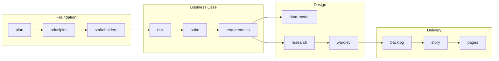

# Plan: The ArcKit Book -- A Comprehensive Documentation Guide

## Context

ArcKit is a mature (v4.6.6, 50 commits on main) Enterprise Architecture Governance & Vendor Procurement Toolkit with 68 slash commands, 10 autonomous agents, 21 hooks, 4 skills, 5 MCP servers, and 6 distribution formats (Claude Code plugin, Gemini CLI extension, Codex CLI, OpenCode CLI, Copilot, and a new Paperclip format). It has 22 test repositories demonstrating real-world use cases. The existing documentation is scattered across README.md (105KB), CLAUDE.md (25KB), CHANGELOG.md (127KB), 90+ guides, and inline command prompts. There is no single narrative document that tells the full story of what ArcKit is, how it works internally, and how to get the most from it.

The user wants a **comprehensive book** covering architecture, design, commands, prompts, hints/tips, and commit highlights -- a single authoritative reference.

## Deliverable

A single Markdown file: `docs/book/ARCKIT-BOOK.md` (with a `docs/book/` directory). This is a long-form documentation guide structured as chapters, readable as-is in any Markdown renderer and on the GitHub Pages site.

## Book Structure (13 Chapters)

```text
docs/book/ARCKIT-BOOK.md
```

### Front Matter

- Title, version (4.6.6), date, author attribution
- Table of contents with chapter links

### Chapter 1: What is ArcKit? (Introduction)

- The problem: architecture governance is broken (scattered docs, inconsistent enforcement, lost traceability)
- The solution: structured, AI-assisted governance with template-driven generation
- The 68-command toolkit at a glance
- Six distribution formats and why they exist
- UK Government context (GDS, TCoP, NCSC, Orange/Green Book)

### Chapter 2: Getting Started

- Installation paths (Claude Code plugin, Gemini extension, Copilot, Codex CLI, OpenCode CLI)
- `arckit init` and project scaffolding
- `/arckit.start` onboarding flow
- Project structure walkthrough (`projects/`, `000-global/`, numbered project dirs)
- First workflow: principles -> stakeholders -> requirements

### Chapter 3: The ArcKit Workflow (The 16-Phase Lifecycle)

- Phase-by-phase walkthrough (Plan -> Principles -> Stakeholders -> Risk -> SOBC -> Requirements -> Data Model -> DPIA -> DataScout -> Research -> Grants -> Wardley -> Roadmap -> Strategy -> ADR -> Procurement -> Design Review -> Backlog -> Trello -> ServiceNow -> DevOps/MLOps/FinOps -> Operationalize -> Traceability -> Analyze -> Compliance -> Story -> Presentation -> Pages)
- Dependency Structure Matrix explained with diagram
- Five workflow paths (Standard, AI/ML, UK Government, Procurement-focused, Quick Start)
- Mandatory vs Recommended vs Optional dependencies



### Chapter 4: Commands Deep Dive (All 68 Commands)

- Organized by tier/category (Foundation, Strategic Context, Requirements & Data, Research & Discovery, Wardley Mapping, Procurement, Design Review, Sprint Planning, Operations, Compliance, Reporting)
- For each command: purpose, inputs (mandatory/recommended/optional predecessors), outputs (doc type code, template used), effort level, handoffs, agent delegation (if any)
- Command anatomy: YAML frontmatter fields (`description`, `argument-hint`, `effort`, `handoffs`, `tags`)
- How `$ARGUMENTS` substitution works
- The "conversational gathering" pattern (max 2 rounds of AskUserQuestion)

### Chapter 5: The Prompt Engineering Anatomy

- How a command prompt is structured (frontmatter -> user input -> instructions -> steps)
- The instruction patterns that recur across all 68 commands:
  - Project context hook awareness ("The ArcKit Project Context hook has already detected...")
  - Template reading with user override (`templates-custom/` -> `templates/` -> plugin default)
  - Prerequisite checking (MANDATORY/RECOMMENDED/OPTIONAL artifact reading)
  - External document and policy scanning (`external/`, `vendors/`, `000-global/policies/`)
  - Citation traceability (`citation-instructions.md`)
  - Document Control auto-population (14 standard fields)
  - Write tool usage for large documents (token limit handling)
  - Summary-only output to user
- How effort levels work (`low`, `medium`, `high`, `max`) -- 58 of 68 commands have explicit effort
- Handoffs schema and workflow navigation

### Chapter 6: The Agent System

- Why agents exist (context isolation for research-heavy commands)
- All 10 agents: research, datascout, aws-research, azure-research, gcp-research, framework, gov-reuse, gov-code-search, gov-landscape, grants
- Agent file structure (frontmatter: `name`, `description`, `model`, `effort`, `maxTurns`, `disallowedTools`)
- `model: inherit` -- agents use whatever model the user runs
- The thin-wrapper pattern: slash command launches agent via Task tool, with direct-execution fallback
- How agent prompts differ from command prompts (autonomous, no AskUserQuestion, write-to-file-and-return-summary)
- Agent line counts: research (373), datascout (473), gov-landscape (323), etc.

### Chapter 7: The Hook System (21 Hooks)

- Hook lifecycle events: SessionStart, Stop, StopFailure, UserPromptSubmit, PreToolUse, PostToolUse, PermissionRequest
- All hooks listed with purpose:
  - `arckit-session.mjs` -- version injection, project detection
  - `version-check.mjs` -- checks for plugin updates
  - `session-learner.mjs` -- captures session insights (Stop + StopFailure)
  - `arckit-context.mjs` -- project context injection on every prompt
  - `secret-detection.mjs` -- prompt secret scanning
  - `sync-guides.mjs` -- copies guides before /arckit:pages
  - `health-scan.mjs` -- full health scan for /arckit:health
  - `traceability-scan.mjs` -- requirements extraction for /arckit:traceability
  - `governance-scan.mjs` -- governance analysis for /arckit:analyze
  - `search-scan.mjs` -- search indexing for /arckit:search
  - `impact-scan.mjs` -- blast radius for /arckit:impact
  - `validate-arc-filename.mjs` -- ARC filename auto-correction (PreToolUse/Write)
  - `score-validator.mjs` -- vendor score validation (PreToolUse/Write)
  - `file-protection.mjs` -- sensitive file blocking (PreToolUse/Edit|Write)
  - `secret-file-scanner.mjs` -- secret file scanning (PreToolUse/Edit|Write)
  - `update-manifest.mjs` -- manifest update after write (PostToolUse/Write)
  - `allow-mcp-tools.mjs` -- auto-allow MCP tools (PermissionRequest)
  - `validate-wardley-math.mjs` -- Wardley Map math validation
- How hooks eliminated boilerplate: context hook removed 1,071 lines across 39 commands; pages hook eliminated ~310 tool calls; health hook eliminated 20-50+ Read calls
- Security hooks: secret detection, file protection, secret file scanning

### Chapter 8: Skills, MCP Servers & References

- 4 Skills: architecture-workflow, mermaid-syntax (30 reference files, 23 diagram types), plantuml-syntax (10 reference files), wardley-mapping (5 reference files + Pinecone MCP)
- 5 MCP Servers: AWS Knowledge, Microsoft Learn, Google Developer Knowledge, Data Commons, govreposcrape (24,500+ UK gov repos)
- 2 Shared references: `citation-instructions.md`, `quality-checklist.md` (10 common + 47 per-type checks)

### Chapter 9: Multi-AI Distribution Architecture

- The source-of-truth model: `arckit-claude/commands/*.md` is canonical
- `scripts/converter.py`: config-driven conversion via `AGENT_CONFIG` dictionary
- Six output formats and their differences:
  - Claude Code plugin (`arckit-claude/`) -- frontmatter + `${CLAUDE_PLUGIN_ROOT}` paths
  - Gemini extension TOML (`arckit-gemini/`) -- paths rewritten to `~/.gemini/extensions/arckit/`, `read_file` -> `cat` for sandbox
  - Codex skills (`arckit-codex/skills/`) -- `SKILL.md` + `agents/openai.yaml`, 250-char description cap
  - OpenCode commands (`arckit-opencode/`) -- `.opencode/commands/`
  - Copilot prompts (`arckit-copilot/prompts/`) -- `.prompt.md` files + custom agents
  - CLI scaffolding via `arckit init`
- Path rewriting, agent inlining, handoffs rendering, effort stripping
- Extension repos: `tractorjuice/arckit-gemini`, `tractorjuice/arckit-codex`, pushed via `scripts/push-extensions.sh`

### Chapter 10: The Template & Document System

- 63 templates in `arckit-claude/templates/`
- Document Control standard (14 fields)
- Revision History format
- Standard footer (Generated by, Generated on, ArcKit Version, Project, Model)
- Document ID system: `ARC-{PROJECT_ID}-{TYPE}-v{VERSION}` (e.g., `ARC-001-REQ-v1.0`)
- Multi-instance types with sequence numbers (ADR, DIAG, WARD, DMC, DFD, RSCH, etc.)
- Template customization: `templates-custom/` override system + `/arckit.customize` command
- Document type codes: 49+ types across categories (Foundation, Requirements, Research, Procurement, Design, Planning, Operations, Compliance, Reporting)
- Requirement ID prefixes (BR-xxx, FR-xxx, NFR-xxx, INT-xxx, DR-xxx)

### Chapter 11: The Autoresearch System (Self-Improving Prompts)

- Inspired by karpathy/autoresearch
- The experiment loop: read -> identify -> edit -> commit -> clean -> execute -> score -> compare -> keep/discard -> log
- Two-layer evaluation: structural gate (8 checks, pass/fail) + LLM-as-judge (5 dimensions, 1-10)
- Git worktree isolation for clean experimentation
- Results tracking in `results.tsv` (score, effort, model columns)
- Plateau detection (15 consecutive discards)
- Real results: gov-reuse 8.4->9.4, gov-code-search 7.4->8.8, gov-landscape 7.6->8.6
- Status line output for live monitoring

### Chapter 12: Development & Operations

- Version management: 13 version files, `scripts/bump-version.sh`
- Release automation: `scripts/generate-release-notes.sh`, GitHub Actions on `v*` tag push
- Development workflow: feature branch -> PR -> merge -> bump -> tag -> push
- Testing: 22 test repositories (v0-v21) with diverse use cases (NHS, MOD, HMRC, Cabinet Office, Scottish Courts, etc.)
- Plugin-based test repos (`.claude/settings.json` with marketplace config)
- Markdown linting: `.markdownlint-cli2.jsonc` + CI enforcement
- Helper scripts: `create-project.sh`, `generate-document-id.sh`, `check-prerequisites.sh`, `list-projects.sh`, `migrate-filenames.sh`
- Pages dashboard: `docs/index.html` with GOV.UK styling, dark mode, Mermaid/PlantUML rendering, interactive zoom/pan, dependency map visualization

### Chapter 13: Highlights from the Commit History

Cherry-picked milestones from the 50-commit history:

| Commit | Highlight | Why It Matters |
|--------|-----------|----------------|
| v1.0.0 (2026-01-28) | Production-ready release | 40 commands, 3 AI platforms, 16 test repos |
| v1.1.0 (2026-02-01) | DataScout command | First data source discovery with weighted scoring |
| v1.2.0 (2026-02-03) | Autonomous Agent System | Research commands delegated to agents via Task tool |
| v1.3.0 (2026-02-03) | External Document Support | 39 commands consume user-provided docs from 3 locations |
| v2.0.0 (2026-02-07) | Plugin migration + 4 new commands | Claude Code moved from CLI to marketplace plugin |
| v2.5.0 (2026-02-17) | Context injection hook | -1,071 lines of boilerplate across 39 commands |
| v2.6.0 (2026-02-17) | SessionStart hook + OpenCode support | 4th distribution format; version auto-injection |
| v2.7.0 (2026-02-19) | UK Cyber Security Standard + Presentation command | GovS 007 alignment, MARP slide decks |
| v2.8.0 (2026-02-20) | Knowledge compounding | Research spawns vendor profiles + tech notes |
| v2.11.0 (2026-02-26) | Mermaid Syntax skill | 30 reference files covering all 23 diagram types |
| v2.15.0 (2026-02-28) | Markdown linting CI | 39K+ violations auto-fixed across 571 files |
| v2.19.0 (2026-02-28) | Pages pre-processor hook | ~310 tool calls -> zero via native hook |
| v4.2.0 (2026-03-11) | Interactive dependency map | SVG visualization in pages dashboard |
| v4.3.0 (2026-03-16) | Wardley sub-commands | 4 new commands (value-chain, doctrine, gameplay, climate) |
| v4.5.0 (2026-03-23) | govreposcrape integration | Semantic search over 24,500+ UK gov repos |
| v4.6.0 (2026-03-24) | Agent model inheritance + autoresearch | Agents use session model; self-improving prompts |
| v4.6.3 (2026-04-06) | Citation traceability | Inline [DOC-CN] markers with structured references |
| v4.6.4 (2026-04-07) | Grants command (68th) | UK funding research with eligibility scoring |
| v4.6.6 (2026-04-09) | Managed agent deployment | Deploy agents via Anthropic API |

### Appendices

- A: Complete Command Reference Table (68 commands with doc type code, effort, agent delegation, tier)
- B: Document Type Code Registry (all 49+ codes with categories)
- C: Hook Reference (all 21 hooks with event, matcher, purpose)
- D: Glossary of Terms

## File to Create

| File | Description |
|------|-------------|
| `docs/book/ARCKIT-BOOK.md` | The complete book (~3,000-4,000 lines) |

## Pre-Compiled Research (docs/book-research/)

Research has already been compiled from git history, memory files, changelogs, and articles. These files contain extracted, organized content ready for direct use in book chapters:

| Research File | Content | Use In Chapters |
|---------------|---------|-----------------|
| `01-origin-story-and-timeline.md` | First commit to v4.6.6; 971 commits, 129 releases, 6 months; version era breakdown (v0.x-v4.x); commit cadence by month; contributor counts | Ch 1 (intro), Ch 13 (history) |
| `02-architecture-and-design.md` | 7 distribution formats table; converter architecture; plugin components (commands, agents, hooks, MCP, skills); data path resolution; document system (control standard, IDs, traceability chain, citation, templates, handoffs) | Ch 4, 5, 6, 7, 8, 9, 10 |
| `03-key-milestones-and-decisions.md` | Plugin pivot (v2.0.0); Gemini multi-platform moment; converter evolution; agent system origin; hooks system growth; Wardley suite; autoresearch findings (Orange Book 4Ts error, Green Book terminology, effort trap); citation traceability; govreposcrape; token limit crisis; managed agents | Ch 3, 6, 7, 11, 13 |
| `04-command-reference.md` | All 68 commands organized by category with agent flags; command naming across 5 platforms; effort levels | Ch 4, Appendix A |
| `05-uk-government-compliance.md` | Every UK Gov framework covered (Green/Orange Book, GDS, NCSC CAF, MOD JSP 453/936, AI Playbook, ATRS, DPIA, govreposcrape, grants); document classification levels; 15 test project descriptions | Ch 1, Ch 3, Ch 5 |
| `06-hints-tips-and-lessons.md` | 5 design principles; 6 notable bugs with lessons (Orange Book 4Ts, Green Book terminology, effort trap, branch vs ref, hook async timing, slugify encoding); tips for command authors; tips for plugin users; security considerations; autoresearch workflow | Ch 5, Ch 6, Ch 11, Ch 12 |
| `07-community-and-contributors.md` | All contributors profiled: tractorjuice (950 commits), @umag (Gemini), @DavidROliverBA (security/health), @alefbt (OpenCode), @johnfelipe (40+ issues); community impact | Ch 1, Ch 13 |
| `08-security-architecture.md` | Full threat model (5 vectors ranked); current 3-layer defenses; identified gaps; 8 prioritized protections with effort estimates | Ch 7, Ch 8 |
| `09-claude-code-platform-evolution.md` | Issue #215 tracking; 14 high-value capabilities; version-by-version fixes (v2.1.89-v2.1.97); minimum version history; ArcKit as platform stress-tester | Ch 6, Ch 7, Ch 12 |
| `10-existing-articles-index.md` | 11 published articles (Medium/LinkedIn) with descriptions; hero images inventory; article adaptation notes | Ch 1, Ch 13 |
| `11-statistics-and-numbers.md` | Every metric: 68 commands, 10 agents, 17 hooks, 5 MCP, 7 formats, 129 releases, 971 commits; growth trajectory table; autoresearch results; Wardley test suite results; MCP coverage; UK Gov coverage | All chapters, Appendices |

## Source Files to Read During Implementation

In addition to the pre-compiled research above, read these primary source files for accuracy and detail:

| File | What to Extract | Priority |
|------|-----------------|----------|
| `README.md` | Workflow phases, command tables, platform support, project structure | High -- Ch 1, 2, 3 |
| `CLAUDE.md` | Architecture internals, patterns, adding commands, version management | High -- Ch 4, 5, 9, 12 |
| `CHANGELOG.md` | All version highlights, feature evolution | High -- Ch 13 |
| `docs/DEPENDENCY-MATRIX.md` | Full DSM matrix data | High -- Ch 3, Appendix |
| `docs/WORKFLOW-DIAGRAMS.md` | 5 workflow path diagrams (Mermaid source) | High -- Ch 3 |
| `arckit-claude/hooks/hooks.json` | Complete hook configuration (events, matchers, handlers) | High -- Ch 7, Appendix C |
| `arckit-claude/.claude-plugin/plugin.json` | Plugin manifest (name, version, description, MCP config) | Medium -- Ch 8, 9 |
| `.mcp.json` | MCP server configuration (URLs, headers, env vars) | Medium -- Ch 8 |
| `scripts/converter.py` | Converter architecture (AGENT_CONFIG dict, format functions) | Medium -- Ch 9 |
| `arckit-claude/commands/requirements.md` | Representative command -- full prompt anatomy | High -- Ch 4, 5 |
| `arckit-claude/commands/research.md` | Representative agent-delegating command -- thin wrapper pattern | High -- Ch 4, 6 |
| `arckit-claude/commands/wardley.md` | Representative command -- Wardley dual output | Medium -- Ch 4 |
| `arckit-claude/commands/pages.md` | Representative command -- hook-dependent command | Medium -- Ch 4, 7 |
| `arckit-claude/commands/health.md` | Representative command -- hook-dependent command | Medium -- Ch 4, 7 |
| `arckit-claude/commands/start.md` | Getting started command -- onboarding flow | High -- Ch 2 |
| `arckit-claude/agents/arckit-research.md` | Representative agent -- full autonomous prompt | High -- Ch 6 |
| `arckit-claude/agents/arckit-datascout.md` | Representative agent -- data discovery | Medium -- Ch 6 |
| `docs/guides/autoresearch.md` | Autoresearch system guide | High -- Ch 11 |
| `arckit-claude/references/citation-instructions.md` | Shared citation logic | Medium -- Ch 5, 10 |
| `arckit-claude/references/quality-checklist.md` | Quality check definitions | Medium -- Ch 5 |
| `CONTRIBUTING.md` | Development practices | Low -- Ch 12 |

## Implementation Steps

1. Create `docs/book/` directory
2. Read pre-compiled research files in `docs/book-research/` first -- they contain organized, extracted content from git history, memory, changelogs, and articles
3. Read primary source files as needed for accuracy and detail beyond what research covers
4. Write `docs/book/ARCKIT-BOOK.md` chapter by chapter
5. Include Mermaid diagrams for: workflow lifecycle, dependency structure, hook event flow, multi-AI distribution pipeline, agent delegation pattern
6. Cross-reference research files against source files to catch any staleness (research was compiled 10 April 2026)
7. Commit and push to branch

## Verification

- File renders correctly in a Markdown viewer (no broken Mermaid, no malformed tables)
- All 68 commands are listed in the appendix
- All 10 agents are covered
- All hooks from hooks.json are documented
- Commit history highlights are accurate (cross-reference CHANGELOG.md)
- No broken internal links
- Research file claims verified against current source files
