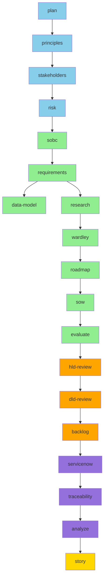
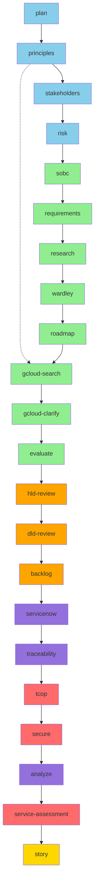
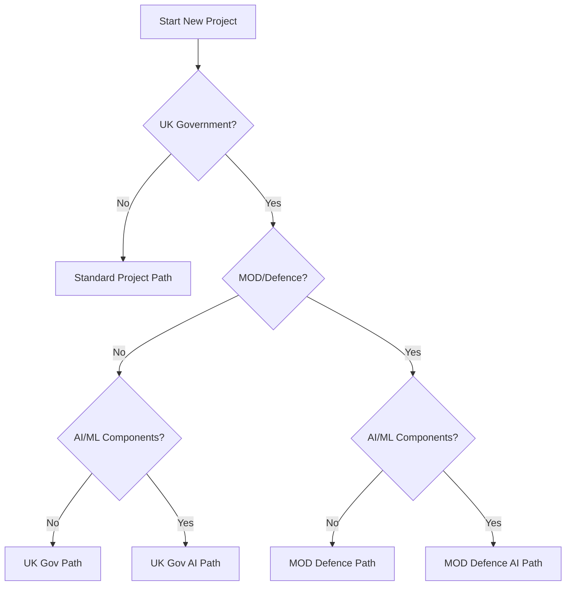
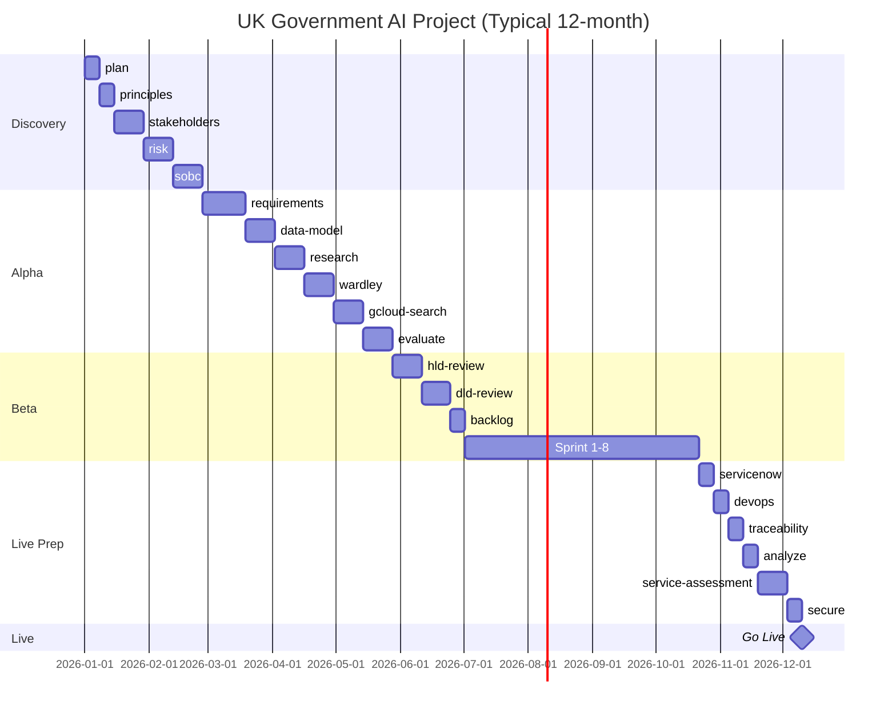
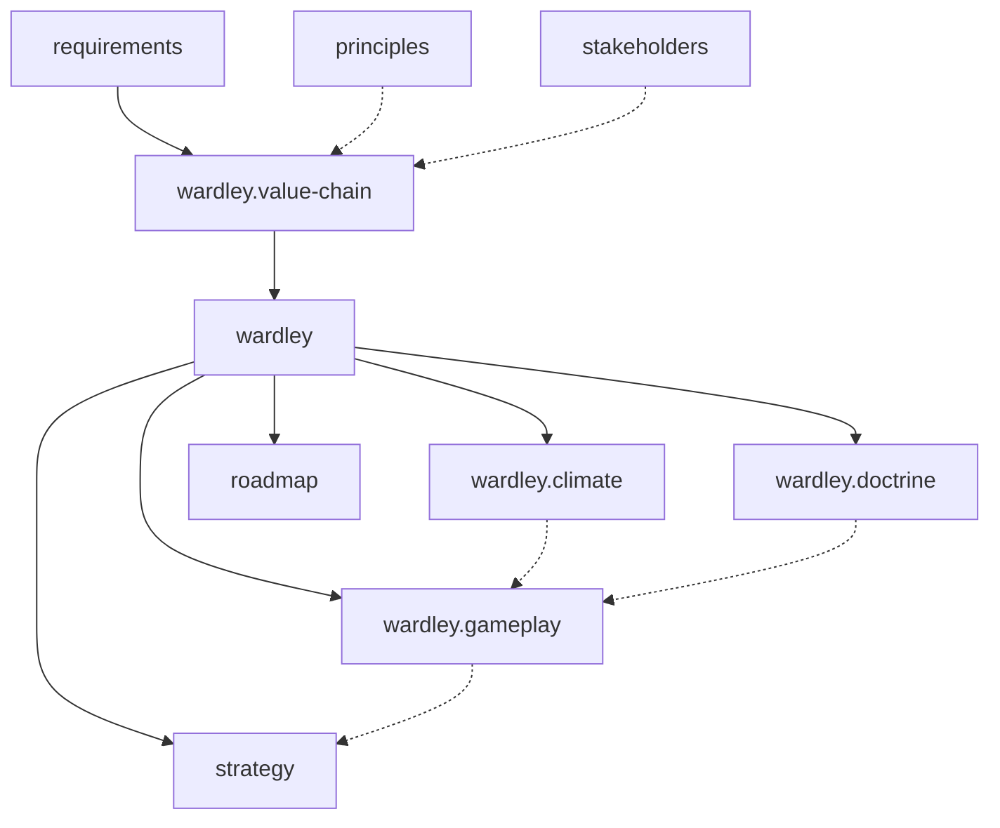
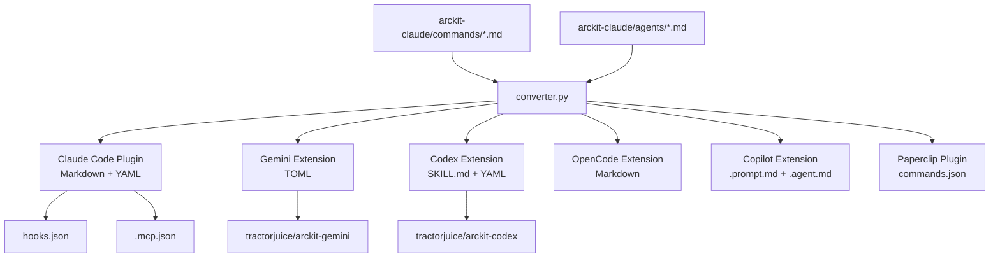
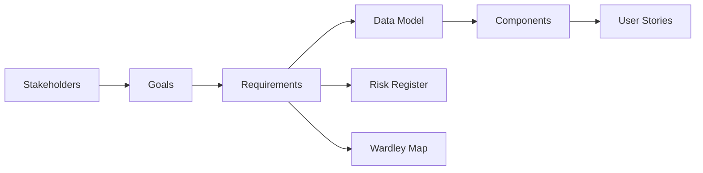

# The ArcKit Book

**Enterprise Architecture Governance & Vendor Procurement Toolkit**

*Version 4.6.6 -- April 2026*

*By TractorJuice and contributors*

---

## Table of Contents

- [Chapter 1: What is ArcKit?](#chapter-1-what-is-arckit)
- [Chapter 2: Getting Started](#chapter-2-getting-started)
- [Chapter 3: The ArcKit Workflow](#chapter-3-the-arckit-workflow)
- [Chapter 4: Commands Deep Dive](#chapter-4-commands-deep-dive)
- [Chapter 5: The Prompt Engineering Anatomy](#chapter-5-the-prompt-engineering-anatomy)
- [Chapter 6: The Agent System](#chapter-6-the-agent-system)
- [Chapter 7: The Hook System](#chapter-7-the-hook-system)
- [Chapter 8: Skills, MCP Servers and References](#chapter-8-skills-mcp-servers-and-references)
- [Chapter 9: Multi-AI Distribution Architecture](#chapter-9-multi-ai-distribution-architecture)
- [Chapter 10: The Template and Document System](#chapter-10-the-template-and-document-system)
- [Chapter 11: The Autoresearch System](#chapter-11-the-autoresearch-system)
- [Chapter 12: Development and Operations](#chapter-12-development-and-operations)
- [Chapter 13: Highlights from the Commit History](#chapter-13-highlights-from-the-commit-history)
- [Appendix A: Complete Command Reference](#appendix-a-complete-command-reference)
- [Appendix B: Document Type Code Registry](#appendix-b-document-type-code-registry)
- [Appendix C: Hook Reference](#appendix-c-hook-reference)
- [Appendix D: Adding a New Command](#appendix-d-adding-a-new-command)
- [Appendix E: Glossary of Terms](#appendix-e-glossary-of-terms)
- [Appendix F: Frequently Asked Questions](#appendix-f-frequently-asked-questions)

---

## Chapter 1: What is ArcKit?

### The Problem: Architecture Governance is Broken

Enterprise architecture governance in most organisations looks something like this: a SharePoint folder with 47 documents, half of them outdated. A Confluence space that nobody updates. A spreadsheet tracking requirements that diverged from the actual system six months ago. Compliance checklists printed out for an audit and never looked at again.

The result is predictable. Architecture decisions are made in isolation. Requirements trace to nothing. Risk registers exist but don't inform design. Business cases reference cost estimates that no one validated. When an auditor asks "show me how Requirement FR-042 influenced your platform choice," the answer is a frantic search through email threads.

This is not a tooling problem -- it's a process problem. Architecture governance needs structure, traceability, and consistency. But imposing that structure manually is so expensive that most teams give up.

Consider the typical enterprise architecture lifecycle:

1. A **business case** is written in Word, emailed for approval, and filed in SharePoint
2. **Requirements** are captured in a Confluence page, with no traceability to the business case
3. A **risk register** exists as an Excel spreadsheet that was last updated three months ago
4. **Architecture decisions** are made in meetings and recorded in emails, if at all
5. **Vendor evaluations** are done ad-hoc, with pricing data that's already out of date
6. **Compliance checks** are performed once, right before go-live, when it's too late to change anything
7. **Design reviews** happen, but the feedback isn't tracked or linked to requirements

Each of these artifacts exists in a different tool, in a different format, maintained by a different person. The connections between them -- the requirements that trace to stakeholder goals, the risks that inform design decisions, the compliance constraints that shape architecture -- exist only in people's heads.

When those people leave, the knowledge leaves with them. When an auditor arrives, the team scrambles to reconstruct the reasoning chain. When a new project starts, the same mistakes are made because the lessons from the last project were never captured in a reusable form.

### The Solution: AI-Assisted, Template-Driven Governance

ArcKit transforms architecture governance from scattered documents into a systematic, repeatable workflow. It provides 68 slash commands that generate architecture artifacts -- requirements documents, risk registers, business cases, Wardley maps, vendor evaluations, compliance assessments -- using templates that enforce consistency and traceability.

Every document ArcKit generates follows the same structure:

- A **Document Control** section with 14 standard fields (ID, type, classification, status, version, owner, approvals)
- A **Revision History** tracking all changes
- **Cross-references** to upstream and downstream artifacts
- **Citation traceability** linking findings to source documents
- A **standard footer** recording the generation tool, date, version, and AI model

The key insight is that AI coding assistants (Claude Code, Gemini CLI, Codex CLI, GitHub Copilot, OpenCode CLI) are not just for writing code. They are document generation engines with web research capabilities. ArcKit harnesses this by providing carefully crafted prompts -- each one a 50-200 line instruction set -- that guide the AI through a structured governance process.

### ArcKit at a Glance


### The Toolkit at a Glance

| Metric | Count |
|--------|-------|
| Slash commands | 68 |
| Autonomous research agents | 10 |
| Automation hooks | 17 registered |
| Skills (reference knowledge) | 4 |
| MCP servers (external data) | 5 |
| Distribution formats | 7 |
| Document templates | 62 |
| Test repositories | 22 |

### Seven Distribution Formats


ArcKit runs on every major AI coding assistant:

| # | Format | Target | Install Method |
|---|--------|--------|----------------|
| 1 | **Claude Code plugin** | Claude Code | Marketplace: `tractorjuice/arc-kit` |
| 2 | **Gemini CLI extension** | Gemini CLI | `gemini extensions install tractorjuice/arckit-gemini` |
| 3 | **Codex CLI extension** | Codex CLI | Published repo: `tractorjuice/arckit-codex` |
| 4 | **OpenCode CLI extension** | OpenCode CLI | `arckit init --ai opencode` |
| 5 | **Copilot extension** | GitHub Copilot | `arckit init --ai copilot` |
| 6 | **CLI package** | pip/uv | `pip install arckit-cli` then `arckit init` |
| 7 | **Paperclip plugin** | Paperclip AI | npm: `@tractorjuice/arckit-paperclip` |

All seven formats are generated from a single source of truth: the Claude Code plugin commands in `arckit-claude/commands/*.md`. A config-driven converter (`scripts/converter.py`) transforms these into each target format, rewriting paths, inlining agent prompts, and adapting to platform-specific conventions.

### UK Government Context

ArcKit has deep UK public sector compliance coverage. Many commands specifically target UK frameworks and standards:

- **HM Treasury Green Book** -- Strategic Outline Business Case (SOBC) with Theory of Change, SMART objectives, and Value for Money analysis
- **HM Treasury Orange Book** -- Risk management with 6 treatment options, Three Lines Model, and cascade analysis
- **GDS Service Standard** -- 14-point service assessment
- **Technology Code of Practice (TCoP)** -- Compliance review against all TCoP points
- **NCSC Cyber Assessment Framework (CAF)** -- Security assessment with maturity scoring
- **MOD Secure by Design (JSP 453)** -- Defence security with CAAT continuous assurance
- **MOD JSP 936** -- AI safety assurance for defence applications
- **UK Government AI Playbook** -- Responsible AI deployment guidance
- **Algorithmic Transparency Recording Standard (ATRS)** -- Mandatory transparency for algorithmic decision-making
- **G-Cloud and Digital Outcomes and Specialists (DOS)** -- Procurement route guidance
- **govreposcrape** -- Semantic search over 24,500+ UK government repositories for code reuse

ArcKit also covers frameworks applicable beyond the UK: TOGAF concepts, Wardley Mapping, C4 model diagrams, data mesh architecture, FinOps, MLOps, DevOps maturity, and ServiceNow service management.

### How ArcKit Differs from Other Tools

ArcKit is not a diagramming tool (like Structurizr or ArchiMate). It is not a requirements management database (like Jama or DOORS). It is not a wiki (like Confluence).

ArcKit is a **prompt-driven governance automation system**. It uses AI coding assistants as document generation engines, guided by carefully crafted prompts that encode governance processes. The key differences:

1. **Template-driven consistency**: Every document follows the same structure. You can't accidentally skip the Risk Register's Three Lines Model section because the template requires it.

2. **Traceability by construction**: Each command reads the outputs of previous commands. Requirements cite stakeholder goals. Data models reference data requirements. The traceability chain is built automatically, not maintained manually.

3. **Real-time research**: MCP servers provide access to AWS, Azure, GCP documentation and 24,500+ UK government repositories. Research commands don't rely on training data -- they search the web.

4. **Multi-platform**: The same governance process works across Claude Code, Gemini, Codex, OpenCode, Copilot, and Paperclip. Switch tools without switching processes.

5. **Self-improving**: The autoresearch system iteratively optimizes command prompts, verifying them against actual government framework content.


### The 22 Test Repositories

ArcKit has been tested on 22 real-world projects spanning healthcare, defence, government, energy, justice, and infrastructure. Public repositories you can explore:

- [NHS Appointment Booking](https://github.com/tractorjuice/arckit-test-project-v7-nhs-appointment) -- Digital health with NHS Spine integration
- [HMRC Tax Assistant](https://github.com/tractorjuice/arckit-test-project-v2-hmrc-chatbot) -- Conversational AI with PII protection
- [Cabinet Office GenAI](https://github.com/tractorjuice/arckit-test-project-v9-cabinet-office-genai) -- Cross-government GenAI platform
- [Scottish Courts GenAI](https://github.com/tractorjuice/arckit-test-project-v14-scottish-courts) -- GenAI strategy with MLOps and FinOps
- [UK Fuel Price Transparency](https://github.com/tractorjuice/arckit-test-project-v17-fuel-prices) -- Real-time pricing service
- [UK Government API Aggregator](https://github.com/tractorjuice/arckit-test-project-v19-gov-api-aggregator) -- Unified access to 240+ government APIs

---

## Chapter 2: Getting Started

### Installation

**Claude Code** is the primary development platform. Install the plugin from the marketplace:

```text
/plugin marketplace add tractorjuice/arc-kit
```

Then enable it from the Discover tab. The plugin provides all 68 commands, 10 agents, 17 hooks, 4 skills, and 5 MCP servers. Updates are automatic.

> **Minimum version**: Claude Code v2.1.97 or later is required.

**Gemini CLI**:

```bash
gemini extensions install https://github.com/tractorjuice/arckit-gemini
```

**GitHub Copilot** (VS Code):

```bash
pip install git+https://github.com/tractorjuice/arc-kit.git
arckit init my-project --ai copilot
```

**Codex CLI** or **OpenCode CLI**:

```bash
pip install git+https://github.com/tractorjuice/arc-kit.git
arckit init my-project --ai codex    # or --ai opencode
```

### The `/arckit.start` Onboarding Flow

The fastest way to get oriented is the start command:

```text
/arckit.start new project
```

This invokes the **architecture-workflow** skill, which:

1. Detects your current project state (existing artifacts, project structure)
2. Asks adaptive questions about your project context (sector, AI components, MOD/civilian, procurement needs)
3. Presents a tailored command plan based on your answers

It does not run any commands -- it gives you a recommended sequence to follow.

### Project Structure

ArcKit projects follow a consistent directory layout:

```text
projects/
  000-global/                    # Cross-project artifacts
    ARC-000-PRIN-v1.0.md         # Architecture principles (shared)
    policies/                    # Enterprise-wide policies
    external/                    # Cross-project reference docs
  001-payment-modernization/     # First project
    ARC-001-REQ-v1.0.md          # Requirements
    ARC-001-STKE-v1.0.md         # Stakeholder analysis
    ARC-001-RISK-v1.0.md         # Risk register
    ARC-001-SOBC-v1.0.md         # Business case
    ARC-001-DATA-v1.0.md         # Data model
    ARC-001-RSCH-v1.0.md         # Research findings
    ARC-001-ADR-001-v1.0.md      # Architecture Decision Record #1
    ARC-001-DIAG-001-v1.0.md     # Architecture diagram #1
    research/                    # Research sub-documents
    vendors/                     # Vendor profiles
    tech-notes/                  # Technology notes
    external/                    # Project-specific reference docs
    wardley-maps/                # Wardley map artifacts
  002-next-project/              # Second project
```

Key conventions:

- **000-global** holds shared artifacts (principles, policies) used by all projects
- Projects are numbered sequentially: `001-*`, `002-*`, `003-*`
- Document IDs follow the pattern `ARC-{PROJECT_ID}-{TYPE}-v{VERSION}`
- Multi-instance types (ADR, DIAG, WARD) get sequential numbers: `ADR-001`, `ADR-002`
- External reference documents go in each project's `external/` directory
- Users can place PDFs, Word docs, and other files there for commands to read

### What Happens When You Open a Project

When you start a Claude Code session in a project with the ArcKit plugin enabled, several things happen automatically:

1. **SessionStart** fires:
   - `arckit-session.mjs` detects the project root, reads the VERSION file, and injects the ArcKit version into context
   - `version-check.mjs` compares your local plugin version against the latest GitHub release and notifies you if an update is available

2. **On your first message**, `UserPromptSubmit` fires:
   - `arckit-context.mjs` scans the project structure and injects a complete inventory of projects, artifacts, external documents, and policies
   - `secret-detection.mjs` scans your input for potential secrets

3. **When commands write files**, `PreToolUse` fires:
   - `validate-arc-filename.mjs` checks that the filename follows the ARC document ID format
   - `file-protection.mjs` blocks writes to protected paths (plugin hooks, templates)

4. **After files are written**, `PostToolUse` fires:
   - `update-manifest.mjs` updates `docs/manifest.json` so the pages dashboard reflects the new document

All of this happens transparently. You never see the hooks run -- they just make everything work.

### Command Naming Across Platforms

| Platform | Invocation | Example |
|----------|-----------|---------|
| Claude Code | `/arckit.{name}` | `/arckit.requirements NHS booking system` |
| Gemini CLI | `/arckit:{name}` | `/arckit:requirements NHS booking system` |
| Codex CLI | `$arckit-{name}` (skill) | `$arckit-requirements NHS booking system` |
| OpenCode CLI | `/arckit.{name}` | `/arckit.requirements NHS booking system` |
| Copilot | `/arckit-{name}` (prompt) | `/arckit-requirements NHS booking system` |

### Your First Workflow

The foundation workflow runs three commands in sequence:

```text
/arckit.principles My Organisation
/arckit.stakeholders 001
/arckit.requirements 001
```

1. **Principles** creates `projects/000-global/ARC-000-PRIN-v1.0.md` -- your organisation's architecture principles that all projects must follow
2. **Stakeholders** creates `projects/001-*/ARC-001-STKE-v1.0.md` -- who cares about this project, what they need, and how they conflict
3. **Requirements** creates `projects/001-*/ARC-001-REQ-v1.0.md` -- the full requirements specification (BR, FR, NFR, INT, DR) informed by principles and stakeholder needs

Each command reads the output of the previous one. Requirements will warn you if stakeholder analysis is missing and suggest you run it first. This traceability chain -- stakeholders inform goals, goals inform requirements, requirements inform everything downstream -- is fundamental to ArcKit's design.

### A Complete Example Session

Here is what a typical early-phase session looks like with Claude Code:

```text
You: /arckit.principles Financial Services Company

[ArcKit generates ARC-000-PRIN-v1.0.md in projects/000-global/]
[Shows summary: 12 principles covering security, scalability, compliance, cloud-first, etc.]
[Suggests: Run /arckit.stakeholders next]

You: /arckit.stakeholders 001 Payment modernization project

[ArcKit creates projects/001-payment-modernization/ directory]
[Generates ARC-001-STKE-v1.0.md]
[Shows summary: 8 stakeholders identified, 3 goal conflicts flagged]
[Suggests: Run /arckit.requirements next]

You: /arckit.requirements 001

[ArcKit reads principles AND stakeholders automatically]
[Generates ARC-001-REQ-v1.0.md with ~150 requirements]
[Each requirement traces to a stakeholder goal]
[Conflict resolution section addresses the 3 flagged conflicts]
[Shows summary: 25 BR, 45 FR, 35 NFR, 20 INT, 25 DR]
[Suggests: Run /arckit.data-model or /arckit.research next]
```

Each command builds on the previous ones. The AI reads the stakeholder analysis when generating requirements. It reads principles to ensure NFRs align with organizational standards. It flags conflicts discovered in the stakeholder analysis and resolves them in the requirements.

### Upgrading

**Claude Code plugin**: Updates are automatic via the marketplace -- no action needed.

**Gemini CLI extension**: Run `gemini extensions update arckit`.

**Codex/OpenCode CLI**: Re-run `arckit init --here --ai codex` (or `--ai opencode`). This updates commands, templates, and scripts while preserving your `projects/` data and custom templates in `.arckit/templates-custom/`.

**GitHub Copilot**: Re-run `arckit init --here --ai copilot` to regenerate prompt files, agents, and instructions.

---

## Chapter 3: The ArcKit Workflow

### The Dependency Structure Matrix


ArcKit's 68 commands are organized into a Dependency Structure Matrix (DSM) with 16 tiers. Each tier represents a phase of the architecture governance lifecycle. Commands in higher tiers depend on artifacts from lower tiers.

| Tier | Phase | Commands |
|------|-------|----------|
| 0 | Foundation | plan, principles |
| 1 | Strategic Context | stakeholders |
| 2 | Risk Assessment | risk |
| 3 | Business Justification | sobc |
| 4 | Requirements | requirements |
| 5 | Strategic Planning | platform-design, roadmap, strategy, framework, glossary |
| 6 | Detailed Design | data-model, data-mesh-contract, dpia, research, datascout, gov-reuse, gov-code-search, gov-landscape, dfd, wardley, wardley.value-chain, wardley.doctrine, wardley.gameplay, wardley.climate, diagram, adr, aws-research, azure-research, gcp-research |
| 7 | Procurement | sow, dos, gcloud-search, gcloud-clarify, evaluate, score |
| 8 | Design Reviews | hld-review, dld-review |
| 9 | Implementation | backlog |
| 10 | Backlog Export | trello |
| 11-12 | Operations and Quality | servicenow, devops, finops, mlops, operationalize, traceability, analyze, principles-compliance |
| 13 | Compliance | conformance, maturity-model, service-assessment, tcop, ai-playbook, atrs, secure, mod-secure, jsp-936 |
| 14 | Reporting | story, presentation |
| 15 | Publishing | pages |

Dependencies come in three strengths:

- **Mandatory**: The command will warn and may refuse to proceed without this artifact
- **Recommended**: The command will note the missing artifact and suggest you create it, but will proceed
- **Optional**: The command reads the artifact silently if available, skips it if not

### Five Workflow Paths

ArcKit provides five pre-defined workflow paths tailored to different project types.


#### 1. Standard Project Path (4-8 months)

For private sector and non-UK government projects without AI components. Follows the full DSM from plan through story.



**Key Milestones**: SOBC Approval -> Requirements Sign-off -> DPIA Complete -> ADR Approved -> Sprint 1 -> Go Live

#### 2. UK Government Project Path (6-12 months)

Adds UK-specific procurement (G-Cloud search, Digital Marketplace) and compliance gates (TCoP, Secure by Design, Service Assessment).



**Key Milestones**: SOBC Approval -> Requirements Sign-off -> G-Cloud Clarifications -> Service Assessment -> Go Live

#### 3. UK Government AI Project Path (9-18 months)

Extends the UK Government path with AI-specific compliance: AI Playbook, ATRS, and MLOps.

**Critical Gates**:

- AI Playbook compliance required before Beta
- ATRS publication required before Live

#### 4. MOD Defence Project Path (12-24 months)

Replaces civilian procurement with DOS (Digital Outcomes and Specialists) and adds MOD Secure by Design (JSP 453) compliance. Requires security clearances.

**Critical Gates**:

- MOD Secure by Design (JSP 440, IAMM) required before Beta
- Security clearances required for team

#### 5. MOD Defence AI Project Path (18-36 months)

The most comprehensive path. Adds JSP 936 AI safety assurance on top of the MOD Defence path. Risk classification determines the approval pathway:

- **Critical**: 2PUS/Ministerial approval
- **Severe/Major**: Defence-Level JROC/IAC approval
- **Moderate/Minor**: TLB-Level approval

### Workflow Decision Tree



### Typical Project Timeline (Gantt)



### Additional Workflow Paths

**Fast-Track Path** (2-4 months): For enhancements to existing systems where architecture principles and governance are already established. Jumps straight to requirements.

**Compliance-Only Path** (2-4 weeks): For auditing existing projects. Runs tcop, secure, principles-compliance, conformance, analyze, and service-assessment in sequence.

### The Wardley Mapping Suite

ArcKit includes a dedicated Wardley Mapping pipeline with four specialized commands:



1. **wardley.value-chain**: Decomposes user needs into value chains with component identification
2. **wardley**: Creates the Wardley Map with dual output (OWM syntax for create.wardleymaps.ai + Mermaid wardley-beta diagram blocks)
3. **wardley.doctrine**: Assesses organizational doctrine maturity across 40+ principles in 4 phases
4. **wardley.climate**: Evaluates 32 climatic patterns across 6 categories
5. **wardley.gameplay**: Analyzes 60+ strategic gameplay patterns with D&D alignment categorization

The suite was built from content extracted from three Wardley Mapping books and validated against 147 real-world maps from the Wardley Map Repository (98% pass rate).

### Wardley Mapping Mathematical Models

ArcKit's Wardley mapping commands include mathematical models for quantitative analysis. The wardley-mapping skill provides:

**Evolution Positioning**: Components are placed on the X-axis using numeric evolution scores (0.00-1.00):

- 0.00-0.25: Genesis (novel, uncertain)
- 0.25-0.50: Custom (bespoke, emerging)
- 0.50-0.75: Product (feature differentiation, maturing)
- 0.75-1.00: Commodity (utility, standardized)

**Visibility Scoring**: Components are placed on the Y-axis by their visibility to users:

- 0.95-1.00: Direct user-facing (user needs, UI)
- 0.70-0.94: Business capabilities
- 0.40-0.69: Supporting infrastructure
- 0.10-0.39: Platform/utility services
- 0.00-0.09: Foundational (power, cooling)

**Inertia Analysis**: Each component gets an inertia score indicating resistance to evolution. High inertia (organizational, contractual, cultural barriers) is flagged for strategic attention.

**Dual Output**: Every Wardley map generates two formats:

1. **OWM (OnlineWardleyMaps) syntax** for interactive visualization at create.wardleymaps.ai:

```text
title NHS Appointment Booking
anchor Patient [0.95, 0.55]
component Booking UI [0.90, 0.65]
component Appointment API [0.75, 0.50]
component NHS Spine [0.60, 0.35]
```

2. **Mermaid wardley-beta** for rendering in documentation and GitHub:

```mermaid
wardley-beta
    title NHS Appointment Booking
    component Patient [0.95, 0.55]
    component Booking UI [0.90, 0.65]
    component Appointment API [0.75, 0.50]
    evolve Appointment API 0.70
```

The Mermaid wardley-beta test suite validated ArcKit's syntax against 147 real-world maps from Simon Wardley's Map Repository. Results: 18/18 synthetic fixtures pass (100%), 144/147 real-world maps pass (98%). The 3 failures are source data errors in original maps. ArcKit's Wardley syntax is 100% valid.

Notable findings from testing:

- `#` comments are not supported in the wardley-beta grammar
- Component names with special characters or keyword prefixes (`label`, `market`) require quoting
- OWM pipeline `[min, max]` ranges are converted via visibility/evolution matching
- 11 new Mermaid features tested: `(market)`, custom evolution labels, dashed arrows, flow links, accelerators, label offsets

### Government Code Discovery

For UK Government projects, three commands search 24,500+ repositories via the govreposcrape MCP server:

- **gov-code-search**: Natural language search across government repos
- **gov-reuse**: Assess reuse opportunities before building from scratch
- **gov-landscape**: Map the government code landscape for a domain

These feed into the research command (adding "Reuse Government Code" as a 5th build-vs-buy option) and the datascout command (discovering existing API client libraries).

---

## Chapter 4: Commands Deep Dive

### Command Anatomy

Every ArcKit command is a Markdown file with YAML frontmatter followed by a prompt body:

```yaml
---
description: Create comprehensive business and technical requirements
argument-hint: "<project ID or feature>"
effort: max
handoffs:
  - command: data-model
    description: Create data model from data requirements
    condition: "DR-xxx data requirements were generated"
  - command: research
    description: Research technology options
---

You are helping an enterprise architect define comprehensive requirements...

## User Input

$ARGUMENTS

## Instructions

1. Identify the target project...
2. Read existing artifacts...
3. Read external documents...
4. Read the template...
5. Generate comprehensive requirements...
```

**Frontmatter fields**:

| Field | Purpose | Example |
|-------|---------|---------|
| `description` | Short description shown in command lists | "Create comprehensive requirements" |
| `argument-hint` | Placeholder shown to user before input | `"<project ID or feature>"` |
| `effort` | Model reasoning effort override | `low`, `medium`, `high`, `max` |
| `handoffs` | Suggested next commands after completion | See schema below |
| `tags` | Searchable keywords | `[research, vendor, procurement]` |

**The `$ARGUMENTS` substitution**: When a user types `/arckit.requirements NHS appointment system`, the text after the command name replaces `$ARGUMENTS` in the prompt. This is how user context enters the command.

### Commands by Category

#### Foundation (Tier 0-1)

| Command | Doc Type | Effort | Description |
|---------|----------|--------|-------------|
| `plan` | PLAN | high | Create implementation plan with phases, milestones, risks |
| `principles` | PRIN | max | Define architecture principles (goes in 000-global) |
| `stakeholders` | STKE | max | Analyze stakeholder drivers, goals, outcomes, RACI |
| `start` | -- | -- | Guided onboarding -- presents a tailored command plan |
| `init` | -- | -- | Initialize project directory structure |

#### Business Case (Tier 2-4)

| Command | Doc Type | Effort | Description |
|---------|----------|--------|-------------|
| `risk` | RISK | max | HM Treasury Orange Book risk management |
| `sobc` | SOBC | max | HM Treasury Green Book Strategic Outline Business Case |
| `requirements` | REQ | max | Business and technical requirements (BR/FR/NFR/INT/DR) |

#### Research and Discovery (Tier 6)

| Command | Doc Type | Effort | Agent? | Description |
|---------|----------|--------|--------|-------------|
| `research` | RSCH | max | Yes | Market research, vendor eval, build vs buy, TCO |
| `datascout` | DSCR | max | Yes | Data source discovery, API catalogues, scoring |
| `aws-research` | RSCH | max | Yes | AWS service research via AWS Knowledge MCP |
| `azure-research` | RSCH | max | Yes | Azure research via Microsoft Learn MCP |
| `gcp-research` | RSCH | max | Yes | GCP research via Google Developer Knowledge MCP |
| `gov-reuse` | GOVR | max | Yes | Government code reuse assessment |
| `gov-code-search` | GCSR | max | Yes | Government code semantic search |
| `gov-landscape` | GLND | max | Yes | Government code landscape analysis |
| `grants` | GRNT | max | Yes | UK grants, funding, and accelerator research |

#### Data Architecture (Tier 6)

| Command | Doc Type | Effort | Description |
|---------|----------|--------|-------------|
| `data-model` | DATA | max | Comprehensive data modeling with ERD |
| `data-mesh-contract` | DMC | high | Data mesh contract generation |
| `dpia` | DPIA | max | Data Protection Impact Assessment |
| `dfd` | DFD | high | Data flow diagrams |

#### Wardley Mapping (Tier 6)

| Command | Doc Type | Effort | Description |
|---------|----------|--------|-------------|
| `wardley` | WARD | max | Wardley Map (OWM + Mermaid dual output) |
| `wardley.value-chain` | WVCH | max | Value chain decomposition |
| `wardley.doctrine` | WDOC | max | Doctrine maturity (40+ principles, 4 phases) |
| `wardley.gameplay` | WGAM | max | Gameplay analysis (60+ patterns, D&D alignment) |
| `wardley.climate` | WCLM | max | Climatic patterns (32 patterns, 6 categories) |

#### Strategic Planning (Tier 5-6)

| Command | Doc Type | Effort | Description |
|---------|----------|--------|-------------|
| `roadmap` | ROAD | max | Technology roadmap |
| `strategy` | STRT | max | Strategic analysis |
| `platform-design` | PLAT | max | Platform architecture design |
| `framework` | FRMK | max | Transform artifacts into structured framework (agent) |
| `glossary` | GLOS | medium | Project glossary with contextual definitions |
| `diagram` | DIAG | high | Architecture diagrams (Mermaid) |
| `adr` | ADR | max | Architecture Decision Records |

#### Procurement (Tier 7)

| Command | Doc Type | Effort | Description |
|---------|----------|--------|-------------|
| `sow` | SOW | max | Statement of Work for vendor RFP |
| `dos` | DOS | max | Digital Outcomes and Specialists procurement |
| `gcloud-search` | -- | high | G-Cloud catalogue search |
| `gcloud-clarify` | -- | high | G-Cloud clarification questions |
| `evaluate` | EVAL | max | Technology evaluation matrix |
| `score` | -- | high | Vendor scoring with JSON storage and audit trail |

#### Design Reviews (Tier 8)

| Command | Doc Type | Effort | Description |
|---------|----------|--------|-------------|
| `hld-review` | HLDR | max | High-level design review |
| `dld-review` | DLDR | max | Detailed-level design review |

#### Implementation (Tier 9-10)

| Command | Doc Type | Effort | Description |
|---------|----------|--------|-------------|
| `backlog` | BKLG | max | Product backlog generation from requirements |
| `story` | STORY | high | User stories from requirements |
| `trello` | -- | medium | Trello board JSON export |

#### Operations (Tier 11-12)

| Command | Doc Type | Effort | Description |
|---------|----------|--------|-------------|
| `servicenow` | SNOW | max | ServiceNow service management design |
| `devops` | DVOP | max | DevOps maturity assessment |
| `mlops` | MLOP | max | MLOps assessment (AI projects) |
| `finops` | FNOP | max | FinOps assessment |
| `operationalize` | OPER | max | Operational readiness assessment |

#### Compliance (Tier 13)

| Command | Doc Type | Effort | Description |
|---------|----------|--------|-------------|
| `tcop` | TCOP | max | Technology Code of Practice review |
| `secure` | SECR | max | UK Government Secure by Design (NCSC CAF) |
| `mod-secure` | MSBD | max | MOD Secure by Design (JSP 453) |
| `jsp-936` | J936 | max | MOD JSP 936 AI safety assurance |
| `ai-playbook` | AIPB | max | UK Government AI Playbook |
| `atrs` | ATRS | max | Algorithmic Transparency Recording Standard |
| `conformance` | CONF | max | Architecture conformance assessment |
| `maturity-model` | MATM | max | Capability maturity assessment |
| `service-assessment` | SVCA | max | GDS Service Standard assessment |
| `principles-compliance` | PRCM | high | Principles compliance check |

#### Quality and Analysis

| Command | Doc Type | Effort | Description |
|---------|----------|--------|-------------|
| `analyze` | ANAL | high | Governance quality analysis |
| `traceability` | TRAC | max | Requirements traceability matrix |
| `impact` | -- | high | Blast radius / reverse dependency analysis |
| `search` | -- | medium | Cross-project artifact search |
| `health` | -- | medium | Stale artifact detection |

#### Reporting and Publishing (Tier 14-15)

| Command | Doc Type | Effort | Description |
|---------|----------|--------|-------------|
| `presentation` | PRES | max | Presentation slide deck (MARP) |
| `pages` | -- | medium | Interactive HTML dashboard |
| `template-builder` | -- | -- | Interactive template creation |
| `customize` | -- | -- | Template customization helper |

### The Conversational Gathering Pattern

Commands that need user input follow a strict pattern: a maximum of 2 rounds of `AskUserQuestion` calls. The first round gathers essential context that cannot be inferred. The second round (if needed) clarifies ambiguities. After that, the command proceeds with what it has.

This prevents the common AI failure mode of asking endless clarifying questions before producing anything.

### Deep Dive: The Wardley Map Command

The Wardley map command (`wardley.md`) is one of ArcKit's most sophisticated commands. It demonstrates several advanced patterns:

**Evolution Stage Framework**: The command includes a complete evolution framework with numeric ranges:

| Stage | Evolution Range | Strategic Action |
|-------|----------------|-----------------|
| Genesis | 0.00-0.25 | Build only if strategic differentiator |
| Custom | 0.25-0.50 | Build vs Buy critical decision point |
| Product | 0.50-0.75 | Buy from vendors, compare features |
| Commodity | 0.75-1.00 | Always use commodity/cloud, never build |

**Dual Output Format**: Since v4.3.1, the command produces both:

1. **OWM syntax** for visualization at create.wardleymaps.ai
2. **Mermaid wardley-beta** diagram blocks for rendering in GitHub, pages dashboard, and documentation

**Hook Integration**: The command declares a `hooks.Stop` entry in its YAML frontmatter for `validate-wardley-math.mjs` (though this hook is not currently wired in hooks.json).

**Rich Prerequisites**: The command reads from up to 10 different artifact types (principles, requirements, stakeholders, research, value chain, doctrine, climate, gameplay, data model, TCoP, AI Playbook) to build the most informed map possible.

### Deep Dive: The Health Command

The health command demonstrates the hook-preprocessor pattern at its most powerful. It scans all projects for seven types of governance issues:

| Rule | Severity | What It Detects |
|------|----------|----------------|
| STALE-RSCH | HIGH | Research documents >6 months old |
| FORGOTTEN-ADR | HIGH | ADRs in "Proposed" status >30 days with no review |
| UNRESOLVED-COND | HIGH | Reviews with "APPROVED WITH CONDITIONS" but no resolution evidence |
| ORPHAN-REQ | MEDIUM | Requirements not referenced by any ADR |
| MISSING-TRACE | MEDIUM | ADRs that don't reference any requirement |
| VERSION-DRIFT | LOW | Multiple artifact versions where the latest is >3 months old |
| STALE-EXT | HIGH | External documents newer than all project artifacts |

The `health-scan.mjs` hook does all the heavy lifting: scanning artifacts, extracting metadata, and applying rules. The command itself only formats the output. This separation means the health command doesn't need to Read a single file -- the hook has already done it.

The health command also writes `docs/health.json` for dashboard integration -- the pages command reads this to show health indicators.

### Deep Dive: The Score Command

The vendor scoring command (`score.md`) is unique in ArcKit because it writes structured JSON, not Markdown. When you score vendors:

1. Evaluations are saved to `docs/scores.json` (structured, machine-readable)
2. Each scoring session adds to (not replaces) the existing data
3. The command supports sensitivity analysis -- how much does the ranking change if weights shift?
4. An audit trail records who scored what, when, and with what weights

The `score-validator.mjs` PreToolUse hook validates the JSON structure before every write to prevent corruption.

---

## Chapter 5: The Prompt Engineering Anatomy

ArcKit's 68 command prompts are not simple instructions -- they are carefully structured programs that guide the AI through a multi-step governance process. Understanding these patterns is essential for anyone who wants to modify existing commands or create new ones.

### Full Anatomy of a Command Prompt

A command prompt has four distinct sections:

```text
[1. YAML Frontmatter]
---
description: What this command does
argument-hint: What the user should provide
effort: max
handoffs:
  - command: next-step
    description: Why this follows
---

[2. Role Setting]
You are helping an enterprise architect define comprehensive
requirements for a project...

[3. User Input Injection]
## User Input
$ARGUMENTS

[4. Step-by-Step Instructions]
## Instructions
1. Identify the target project...
2. Read existing artifacts...
3. Read external documents...
4. Read the template...
5. Generate the output...
6. Ensure traceability...
7. Write the output using Write tool...
```

The frontmatter configures how Claude Code presents and executes the command. The role setting establishes the AI's persona. `$ARGUMENTS` is replaced with whatever the user types after the command name. The instructions are the core logic -- typically 100-180 lines of detailed steps.

### The Recurring Instruction Patterns

Every ArcKit command prompt follows a recognizable structure. Understanding these patterns helps you read, modify, and create commands.

#### Pattern 1: Project Context Hook Awareness

```markdown
> **Note**: The ArcKit Project Context hook has already detected all
> projects, artifacts, external documents, and global policies. Use
> that context below -- no need to scan directories manually.
```

The `arckit-context.mjs` hook runs on every `UserPromptSubmit` event and injects a complete inventory of the project state into context. Commands reference this pre-computed inventory rather than scanning directories themselves. This eliminated 1,071 lines of boilerplate across 39 commands.

#### Pattern 2: Template Reading with User Override

```markdown
4. **Read the template** (with user override support):
   - **First**, check if `.arckit/templates/requirements-template.md` exists
   - **If found**: Read the user's customized template (user override)
   - **If not found**: Read `${CLAUDE_PLUGIN_ROOT}/templates/requirements-template.md`
```

Templates have a two-tier resolution: user customizations in `.arckit/templates/` or `.arckit/templates-custom/` take precedence over plugin defaults. This lets organisations adapt ArcKit's output without forking the plugin.

#### Pattern 3: Prerequisite Checking

Commands declare prerequisites at three levels:

```markdown
2. **Read existing artifacts**:

   **MANDATORY** (warn if missing):
   - **STKE** (Stakeholder Analysis) -- Extract: goals, priorities, drivers

   **RECOMMENDED** (read if available, note if missing):
   - **PRIN** (Architecture Principles) -- Extract: standards, constraints

   **OPTIONAL** (read if available, skip silently):
   - **PLAN** (Project Plan) -- Extract: timeline constraints
```

This creates a self-documenting dependency chain. When a command warns "Stakeholder analysis is missing -- run `/arckit.stakeholders` first," that warning is built into the prompt, not the tooling.

#### Pattern 4: External Document and Policy Scanning

```markdown
3. **Read external documents and policies**:
   - Read external documents in `external/` -- extract requirements, constraints
   - Read global policies in `000-global/policies/`
   - Read enterprise standards in `projects/000-global/external/`
```

ArcKit commands consume user-provided documents (PDFs, Word docs, policy files) from three locations. This is how real-world context enters the generation process -- the AI reads your organisation's actual policies, RFP documents, and legacy system specs.

#### Pattern 5: Citation Traceability

```markdown
   - **Citation traceability**: Follow the citation instructions in
     `${CLAUDE_PLUGIN_ROOT}/references/citation-instructions.md`.
     Place inline citation markers (e.g., `[PP-C1]`) next to findings.
```

When a command reads external documents, it must add inline citation markers and populate an "External References" section. The citation system is detailed and precise:

**Document Abbreviation Rules**: Derive a short Doc ID from each filename by taking the first letter of each significant word (skip "the", "and", "of"). Examples:

| Filename | Doc ID |
|----------|--------|
| `privacy-policy.pdf` | PP |
| `security-framework-v2.docx` | SF |
| `nhs-digital-service-manual.pdf` | NDSM |

**Citation ID Format**: `[{DOC_ID}-C{N}]` where N is sequential per document. Example: `[PP-C1]`, `[PP-C2]`, `[SF-C1]`.

**Inline Placement**: Citations attach to the specific claim, not grouped at paragraph end:

```markdown
The system must encrypt all personal data at rest using AES-256 [SF-C1]
and in transit using TLS 1.3 [SF-C2].
```

**Three-Table External References Section**:

1. **Document Register**: Every external document read, whether cited or not
2. **Citations**: Every inline marker with doc ID, page/section, category, and quoted passage
3. **Unreferenced Documents**: Documents read but not cited (demonstrates comprehensive review)

Each citation gets a category: Business Requirement, Functional Requirement, Compliance Constraint, Security Requirement, Risk Factor, Design Decision, Stakeholder Need, etc.

This system was implemented in v4.6.3 across 43 commands and 7 agents. It addresses a real client need: auditors want to verify that ArcKit reviewed all input documents and that every finding traces to a source.

#### Pattern 6: Write Tool for Large Documents

```markdown
   Use the **Write** tool to save the complete document to file.
   Show only a summary to the user.
```

This pattern exists because of a hard lesson learned early in ArcKit's development. When the ServiceNow command tried to output a full document directly to the user, it hit Claude's 32K output token limit and truncated. The fix: always write to file, show only a summary.

#### Pattern 7: Quality Checklist Verification

```markdown
   Before writing the file, read
   `${CLAUDE_PLUGIN_ROOT}/references/quality-checklist.md` and verify
   all Common Checks plus the per-type checks pass.
```

The quality checklist contains 10 common checks (Document Control complete, Revision History present, requirement IDs sequential, etc.) plus 47 per-type checks. Commands verify their output before writing.

### Effort Levels

The `effort:` frontmatter field controls the AI model's reasoning depth:

| Level | When to Use | Example Commands |
|-------|-------------|-----------------|
| `max` | Deep analysis that benefits from extended reasoning | requirements, research, sobc, risk |
| `high` | Analytical commands with moderate complexity | analyze, diagram, dfd, impact |
| `medium` | Standard generation | glossary, pages, search |
| `low` | Simple utility operations | customize, init |

As of v4.6.0, 58 of 68 commands have effort explicitly set. An important finding from autoresearch: higher effort is not always better. The glossary command actually produced worse output at `effort: high` -- definitions became more generic and less contextually specific.

### The Handoffs Schema

Commands declare suggested next steps in frontmatter:

```yaml
handoffs:
  - command: data-model
    description: Create data model from data requirements
    condition: "DR-xxx data requirements were generated"
  - command: research
    description: Research technology options
```

Each handoff entry has:

- `command` (required): The command name (matches the filename stem)
- `description` (optional): Why this is a logical next step
- `condition` (optional): When this handoff applies

The converter renders these as "Suggested Next Steps" sections in non-Claude formats. In the Claude Code plugin, handoffs remain as YAML frontmatter that Claude reads directly.

---

## Chapter 6: The Agent System

### Why Agents Exist

Research-heavy commands make dozens of WebSearch and WebFetch calls to gather vendor pricing, product reviews, compliance data, and government documentation. If this research happened in the main conversation, the search results would flood the context window, pushing out earlier conversation history.

ArcKit solves this with **agent delegation**: the slash command is a thin wrapper (10-20 lines) that launches an autonomous agent via the Task tool. The agent runs in its own context window, performs all the research, writes the document to file, and returns only a summary.

### The Thin Wrapper Pattern

Here is the complete research command -- the thin wrapper that delegates to the agent:

```markdown
### What to Do

1. Determine the project
2. Launch the **arckit-research** agent with the project path and user context
3. Report the result when the agent completes

### Alternative: Direct Execution

If the Task tool is unavailable, fall back to the full research process...
```

The fallback ensures commands work even on platforms that don't support agent delegation (Codex, OpenCode, Gemini). The converter inlines the full agent prompt for these platforms.

### All 10 Agents

| Agent | Lines | Purpose | MCP Servers Used |
|-------|-------|---------|-----------------|
| `arckit-research` | 373 | Market research, vendor eval, build vs buy, TCO | -- |
| `arckit-datascout` | 473 | Data source discovery, API catalogues, scoring | -- |
| `arckit-aws-research` | 287 | AWS service research | AWS Knowledge |
| `arckit-azure-research` | 281 | Azure service research | Microsoft Learn |
| `arckit-gcp-research` | 282 | GCP service research | Google Dev Knowledge |
| `arckit-framework` | 211 | Transform artifacts into structured framework | -- |
| `arckit-gov-reuse` | 287 | Government code reuse assessment | govreposcrape |
| `arckit-gov-code-search` | 252 | Government code semantic search | govreposcrape |
| `arckit-gov-landscape` | 323 | Government code landscape analysis | govreposcrape |
| `arckit-grants` | 212 | UK grants, funding, accelerators | -- |

Total: 2,981 lines of agent prompts.

### Agent Frontmatter

```yaml
---
name: arckit-research
maxTurns: 50
disallowedTools: ["Edit"]
effort: max
model: inherit
description: |
  Use this agent when the user needs technology research...
---
```

- **name**: Agent identifier (must match `arckit-{name}` convention)
- **description**: Triggers automatic agent selection -- Claude reads this to decide when to launch the agent
- **model: inherit**: Since v4.6.0, all agents inherit the session model. Opus users get Opus agents; Sonnet users get Sonnet agents
- **maxTurns**: Cap on autonomous execution to prevent runaway token consumption
- **disallowedTools**: Least-privilege restriction (research agents can't Edit files, only Write new ones)
- **effort**: Reasoning depth for the agent's model

### How Agent Prompts Differ from Commands

| Aspect | Command Prompt | Agent Prompt |
|--------|---------------|-------------|
| Execution | Interactive, in main context | Autonomous, isolated context |
| User interaction | Up to 2 AskUserQuestion rounds | No user interaction |
| Output | Summary shown to user | Write document to file, return summary only |
| Length | 50-200 lines | 200-475 lines |
| Web research | Minimal (0-5 calls) | Extensive (20-50+ calls) |
| Context isolation | Shares main context | Own context window |

### Inside the Research Agent: A Detailed Walkthrough

The research agent (`arckit-research.md`, 373 lines) is the most complex agent. Here is its complete process:

**Step 1: Read Available Documents** -- Read requirements (mandatory), principles, stakeholder analysis, data model, risk register. Extract FR/NFR/INT/DR IDs. Detect if UK Government project by scanning for "UK Government", "Ministry of", "NHS", "MOD" in project name.

**Step 1b: Check for External Documents** -- Look in `projects/{project}/external/` for market research reports, analyst briefings (Gartner, Forrester), vendor comparisons. These enhance output but are never blocking.

**Step 2: Read Template** -- Read the research findings template for output structure.

**Step 3: Extract and Categorize Requirements** -- Parse the requirements document and categorize by FR, NFR, INT, DR prefixes.

**Step 4: Dynamically Identify Research Categories** -- This is critical: the agent does NOT use a fixed list. It scans requirements for keywords that indicate technology needs:

- "login", "SSO", "MFA" -> Authentication and Identity
- "payment", "PCI-DSS" -> Payment Processing
- "database", "persistence" -> Database and Storage
- "queue", "pub/sub" -> Messaging and Events
- "machine learning", "AI" -> ML/AI

If requirements reveal categories not in this list, the agent researches those too.

**Step 5: Conduct Web Research** -- For each category, the agent performs 6-8 searches:

- **Vendor Discovery**: WebSearch for SaaS vendors, market leaders, comparisons
- **Vendor Details**: WebFetch pricing pages, feature pages, documentation
- **Reviews**: WebSearch for G2 reviews, Gartner ratings, competitor comparisons
- **Open Source**: WebSearch for GitHub repos -- check stars, forks, last commit, license
- **UK Government** (if applicable): WebFetch Digital Marketplace, GOV.UK platforms (One Login, Pay, Notify, Forms)
- **Cost and TCO**: Search for pricing calculators, hidden costs (integration, training, exit)
- **Compliance**: Check ISO 27001, SOC 2, GDPR, UK data residency, security incidents

**Step 5b: Government Code Reuse Check** -- Search govreposcrape for existing UK government implementations. Add "Reuse Government Code" as a 5th build-vs-buy option alongside Build Custom, Buy SaaS, Adopt Open Source, and GOV.UK Platform.

**Step 6: Build vs Buy Analysis** -- For each category, compare all options on cost, fit, risk, and timeline.

**Step 7: Write Document** -- Use the Write tool to create the research findings document. Show only a summary.

**Step 8: Knowledge Compounding** -- Create vendor profiles and tech notes (see below).

This entire process runs autonomously in the agent's isolated context window. The main conversation only sees the final summary.

### Knowledge Compounding

The research agent (and datascout) create additional artifacts beyond the main document:

- **Vendor profiles** at `projects/{project}/vendors/{vendor-slug}-profile.md` -- one per vendor evaluated in depth
- **Tech notes** at `projects/{project}/tech-notes/{topic-slug}.md` -- one per significant technology finding

Existing profiles and notes are updated rather than duplicated. This "knowledge compounding" means each research run enriches the project's knowledge base for future commands.

---

## Chapter 7: The Hook System

### Overview

ArcKit's hook system provides reactive automation -- code that runs in response to lifecycle events. Hooks are JavaScript (`.mjs`) files in `arckit-claude/hooks/`, registered in `hooks.json`. They are the invisible layer that makes ArcKit feel intelligent: detecting project context, validating filenames, protecting sensitive files, and building search indices -- all without the user seeing any of it.

There are 17 registered handlers across 7 event types, plus 1 unwired handler (`validate-wardley-math.mjs`) and 3 utility files (`hook-utils.mjs`, `graph-utils.mjs`, `hooks.json`).

### How Hooks Work

Claude Code's hook system works like middleware. When an event occurs (session start, user message, tool invocation), Claude Code checks `hooks.json` for matching handlers. Each handler:

1. Receives event data as JSON on stdin (tool name, file path, user message, etc.)
2. Processes the data (scans files, validates content, builds indices)
3. Returns output that gets injected into the AI's context (or blocks the operation)

Hooks can:

- **Inject context**: Return text that appears in the conversation (e.g., project inventory)
- **Block operations**: Exit with code 2 to prevent a tool from executing (e.g., blocking writes to protected files)
- **Run silently**: Perform side effects (e.g., updating manifest.json) without visible output

The `hooks.json` format maps events to handlers:

```json
{
  "hooks": {
    "PreToolUse": [
      {
        "matcher": "Write",
        "hooks": [
          {
            "type": "command",
            "command": "node ${CLAUDE_PLUGIN_ROOT}/hooks/validate-arc-filename.mjs",
            "timeout": 5
          }
        ]
      }
    ]
  }
}
```

The `matcher` field determines when the hook runs: `".*"` for all events, `"Write"` for Write tool invocations, `"/arckit:pages"` for a specific command.

### Event Types and Handlers

#### SessionStart (runs once when Claude Code starts)

| Handler | Timeout | Purpose |
|---------|---------|---------|
| `arckit-session.mjs` | 5s | Injects ArcKit version, detects project root, sets session context |
| `version-check.mjs` | 5s | Compares local plugin version against latest GitHub release; notifies user of updates |

#### UserPromptSubmit (runs on every user message)

**Global handlers** (run on all prompts):

| Handler | Timeout | Purpose |
|---------|---------|---------|
| `arckit-context.mjs` | 10s | Scans project directories and injects a complete inventory of projects, artifacts, external documents, and policies into context |
| `secret-detection.mjs` | 5s | Scans user input for potential secrets (API keys, passwords, tokens) |

**Command-specific handlers** (run only when the matched command is invoked):

| Handler | Matcher | Timeout | Purpose |
|---------|---------|---------|---------|
| `sync-guides.mjs` | `/arckit:pages` | 15s | Copies guide files into docs/ before pages generation |
| `health-scan.mjs` | `/arckit:health` | 30s | Full project health scan -- staleness, orphans, missing artifacts |
| `traceability-scan.mjs` | `/arckit:traceability` | 20s | Extracts all requirement IDs and cross-references |
| `governance-scan.mjs` | `/arckit:analyze` | 30s | Full governance quality analysis across all artifacts |
| `search-scan.mjs` | `/arckit:search` | 15s | Builds search index across all project files |
| `impact-scan.mjs` | `/arckit:impact` | 20s | Computes dependency graph for blast radius analysis |

#### PreToolUse (runs before Write or Edit operations)

| Handler | Matcher | Timeout | Purpose |
|---------|---------|---------|---------|
| `validate-arc-filename.mjs` | Write | 5s | Validates ARC document ID format in filenames |
| `score-validator.mjs` | Write | 5s | Validates vendor score JSON structure |
| `file-protection.mjs` | Edit\|Write | 5s | Blocks writes to protected paths (hooks, plugin files) |
| `secret-file-scanner.mjs` | Edit\|Write | 5s | Scans file content for embedded secrets |

#### PostToolUse (runs after Write operations)

| Handler | Matcher | Timeout | Purpose |
|---------|---------|---------|---------|
| `update-manifest.mjs` | Write | 5s | Updates `docs/manifest.json` after any artifact write |

#### Stop and StopFailure (runs when session ends)

| Handler | Timeout | Purpose |
|---------|---------|---------|
| `session-learner.mjs` | 10s | Captures session insights for future reference |

#### PermissionRequest (runs when MCP tools are invoked)

| Handler | Matcher | Timeout | Purpose |
|---------|---------|---------|---------|
| `allow-mcp-tools.mjs` | `mcp__.*` | 5s | Auto-allows MCP tool invocations by prefix |

### How Hooks Eliminated Boilerplate

The hook system's most dramatic impact was removing duplicated code from commands:

- **Context hook** (`arckit-context.mjs`): Removed 1,071 lines of directory scanning boilerplate from 39 commands. Before hooks, every command had its own "scan projects/ directory" step.
- **Pages hook** (`sync-guides.mjs`): Eliminated approximately 310 tool calls that the pages command previously needed to copy guide files manually.
- **Health hook** (`health-scan.mjs`): Eliminated 20-50+ Read calls that the health command would have needed to scan all artifacts for staleness.

### Hook Architecture Diagram

```mermaid
graph TD
    subgraph "Session Lifecycle"
        SS[SessionStart] --> |arckit-session.mjs| CTX1[Inject version + project root]
        SS --> |version-check.mjs| VER[Check for plugin updates]
    end

    subgraph "Every User Message"
        UPS[UserPromptSubmit] --> |arckit-context.mjs| CTX2[Inject full project inventory]
        UPS --> |secret-detection.mjs| SEC1[Scan for secrets in input]
    end

    subgraph "Command-Specific Preprocessing"
        UPS --> |/arckit:pages| SYNC[sync-guides.mjs]
        UPS --> |/arckit:health| HLTH[health-scan.mjs]
        UPS --> |/arckit:traceability| TRAC[traceability-scan.mjs]
        UPS --> |/arckit:analyze| GOV[governance-scan.mjs]
        UPS --> |/arckit:search| SRCH[search-scan.mjs]
        UPS --> |/arckit:impact| IMP[impact-scan.mjs]
    end

    subgraph "Before Write/Edit"
        PTU[PreToolUse] --> |Write| VAL[validate-arc-filename.mjs]
        PTU --> |Write| SCORE[score-validator.mjs]
        PTU --> |Edit or Write| FP[file-protection.mjs]
        PTU --> |Edit or Write| SFS[secret-file-scanner.mjs]
    end

    subgraph "After Write"
        POTU[PostToolUse] --> |Write| MAN[update-manifest.mjs]
    end

    subgraph "Session End"
        STOP[Stop / StopFailure] --> |session-learner.mjs| LEARN[Capture session insights]
    end

    subgraph "Permissions"
        PERM[PermissionRequest] --> |mcp__*| ALLOW[allow-mcp-tools.mjs]
    end
```



### The Boilerplate Reduction Story

Before hooks existed (pre-v2.5.0), every command contained its own directory scanning code. A typical command had 25-30 lines of "scan the projects/ directory, find artifacts, list external documents, read global policies" that was copy-pasted across all 39 applicable commands.

The `arckit-context.mjs` hook replaced all of this. It runs on every `UserPromptSubmit` event and injects a complete JSON inventory of:

- All projects with their numbered directories
- All artifacts per project with document type codes and versions
- All external documents per project
- All global policies in `000-global/policies/`
- The current project (auto-detected from the user's working directory or prompt)

Commands now simply reference "the ArcKit Project Context (above)" instead of scanning directories themselves. The reduction: 1,071 lines removed from 39 commands.

Similarly, the pages command previously needed to:

1. List all guide files in `docs/guides/`
2. Copy each one to the output directory
3. Read each guide for metadata

The `sync-guides.mjs` hook does this automatically when `/arckit:pages` is invoked, eliminating approximately 310 tool calls.

### Lessons from Hook Development

**Async vs Synchronous**: Early hooks were marked `async: true` for performance. But async hooks run in the background and cannot inject context into the current response. The `arckit-context.mjs` hook MUST be synchronous because the command needs the project inventory in the same turn. This was discovered when context injection silently stopped working (v2.21.2).

**Timeout Tuning**: Hook timeouts range from 5s (simple validation) to 30s (full governance scan). Setting timeouts too low causes hooks to be killed mid-execution; too high wastes time when hooks fail. The current values were tuned through production use across 22 test repositories.

**Matcher Specificity**: Global hooks (matcher: `.*`) run on every message. Command-specific hooks (matcher: `/arckit:pages`) run only for that command. This distinction is critical for performance -- running the governance-scan hook on every message would add 30s of overhead to every interaction.

### The Unwired Hook

`validate-wardley-math.mjs` exists in the hooks directory since v4.0.0 but has never been registered in `hooks.json`. It validates Wardley Map coordinate and stage consistency. It remains a candidate for future activation.

---

## Chapter 8: Skills, MCP Servers and References

### Skills

Skills are directories in `arckit-claude/skills/` containing reference knowledge that Claude can access. ArcKit has 4 skills:

| Skill | Reference Files | Purpose |
|-------|----------------|---------|
| `architecture-workflow` | -- | End-to-end governance workflow guide; used by `/arckit.start` for onboarding |
| `mermaid-syntax` | 30 files | Mermaid diagram syntax for all 23 diagram types (flowchart, sequence, class, state, ER, C4, Gantt, mindmap, etc.) |
| `plantuml-syntax` | 10 files | PlantUML C4 diagram syntax for architecture diagrams |
| `wardley-mapping` | 5 files | Wardley Map syntax, mathematical models, OWM format, and Mermaid wardley-beta format |

Skills differ from commands: they provide reference knowledge that enhances the AI's capabilities rather than driving a specific workflow. When the diagram command needs to generate a C4 context diagram, the mermaid-syntax skill provides the exact syntax rules.

### The Guide System

ArcKit ships 90+ usage guides in `docs/guides/` (and mirrored in `arckit-claude/guides/`). Guides explain how to use each command, what it produces, and how its output connects to other commands.

Guides are organized by category and have a maturity status:

| Status | Meaning | Example Guides |
|--------|---------|---------------|
| **live** | Production-ready, well-tested | requirements, stakeholders, principles, risk, sobc |
| **beta** | Feature-complete, moderately tested | research, strategy, backlog, analyze, tcop |
| **alpha** | Working but with limited testing | data-mesh-contract, ai-playbook, pages |
| **experimental** | Early adopters only | platform-design, wardley, datascout, dos |

In addition to command guides, ArcKit provides **DDaT Role Guides** that map commands to UK Government [DDaT Capability Framework](https://ddat-capability-framework.service.gov.uk/) roles. 18 role guides cover 6 DDaT families:

| Family | Roles |
|--------|-------|
| Architecture | Enterprise Architect (12 commands), Solution Architect (10), Data Architect (4), Security Architect (5), Business Architect (5), Technical Architect (5), Network Architect (3) |
| Chief Digital and Data | CTO/CDIO (5), CDO (4), CISO (5) |
| Product and Delivery | Product Manager (5), Delivery Manager (6), Business Analyst (4), Service Owner (3) |
| Data | Data Governance Manager (4), Performance Analyst (4) |
| IT Operations | IT Service Manager (3) |
| Software Development | DevOps Engineer (3) |

These role guides answer the question "I'm an Enterprise Architect -- which ArcKit commands are most relevant to me?"

The `sync-guides.mjs` hook copies guides from the plugin to the project's `docs/guides/` directory when `/arckit.pages` runs. The pages dashboard renders them in a searchable, categorized library with status badges.

### MCP Servers

Model Context Protocol (MCP) servers provide real-time access to external documentation and data. ArcKit bundles 5 servers:

| Server | URL | API Key | Purpose |
|--------|-----|---------|---------|
| AWS Knowledge | `knowledge-mcp.global.api.aws` | No | AWS service documentation, best practices, architecture guidance |
| Microsoft Learn | `learn.microsoft.com/api/mcp` | No | Azure and Microsoft documentation, code samples |
| Google Developer Knowledge | Google Cloud API | Yes (`GOOGLE_API_KEY`) | GCP documentation and guidance |
| Data Commons | Google Data Commons API | Yes (`DATA_COMMONS_API_KEY`) | Statistical data for evidence-based architecture |
| govreposcrape | Cloud Run instance | No | Semantic search over 24,500+ UK government repositories |

MCP servers are configured in `.mcp.json` at the plugin root and registered via `plugin.json`. The `allow-mcp-tools.mjs` hook auto-approves MCP tool invocations so users don't see permission prompts for every search.

#### MCP Server Configuration

The `.mcp.json` file is simple:

```json
{
  "mcpServers": {
    "aws-knowledge": {
      "type": "http",
      "url": "https://knowledge-mcp.global.api.aws"
    },
    "microsoft-learn": {
      "type": "http",
      "url": "https://learn.microsoft.com/api/mcp"
    }
  }
}
```

AWS Knowledge and Microsoft Learn are HTTP-based servers that require no API keys. Google Developer Knowledge and Data Commons require environment variables (`GOOGLE_API_KEY`, `DATA_COMMONS_API_KEY`) set via headers.

govreposcrape is a Cloud Run instance that indexes UK government GitHub repositories. It provides semantic search (not just keyword matching) and requires no authentication.

#### How Agents Use MCP Servers

Each research agent is designed around specific MCP servers:

- **arckit-aws-research**: Uses `aws-knowledge` tools to search AWS documentation, get service details, pricing, and architecture guidance
- **arckit-azure-research**: Uses `microsoft-learn` tools -- `microsoft_docs_search` for quick overviews, `microsoft_code_sample_search` for examples, `microsoft_docs_fetch` for full page content
- **arckit-gcp-research**: Uses Google Developer Knowledge for GCP documentation
- **arckit-gov-reuse, arckit-gov-code-search, arckit-gov-landscape**: All use `govreposcrape` for semantic search across 24,500+ UK government repositories

Non-MCP agents (research, datascout, grants) use WebSearch and WebFetch for all their research.

#### The govreposcrape Integration Story

govreposcrape (v4.5.0) was a significant addition because it enabled a new category of analysis: checking if UK government code already exists before building or buying. The research agent gained a 5th build-vs-buy option ("Reuse Government Code") alongside Build Custom, Buy SaaS, Adopt Open Source, and GOV.UK Platform.

This reflects a real government practice: the UK Government Service Standard requires teams to "make use of open standards and common platforms." govreposcrape makes this practical by providing searchable access to what other government teams have already built.

### Shared References

Two reference files are shared across all commands:

1. **`citation-instructions.md`**: Defines citation traceability rules -- how to create inline markers (`[DOC_ID-CN]`), abbreviation rules for document IDs, quoting rules, and the three-table External References format
2. **`quality-checklist.md`**: A comprehensive validation framework with 10 common checks and 47 per-type checks

#### The Quality Checklist in Detail

**10 Common Checks** (all artifacts must pass):

1. **Document Control complete** -- All 14 standard fields populated
2. **Document ID convention** -- Follows `ARC-{PROJECT_ID}-{TYPE}-v{VERSION}` pattern
3. **No placeholder text** -- No remaining `[PLACEHOLDER]`, `TODO`, `TBD`, `XXX`, or `YYYY-MM-DD` tokens
4. **Classification set** -- One of: PUBLIC, OFFICIAL, OFFICIAL-SENSITIVE, SECRET
5. **Status set** -- One of: DRAFT, IN_REVIEW, APPROVED, PUBLISHED, SUPERSEDED, ARCHIVED
6. **Revision History present** -- Table with proper columns, at least one row
7. **Generation footer present** -- Standard footer with tool, date, version, project, model
8. **Clean Markdown** -- No broken tables, unclosed code blocks, malformed links
9. **Consistent tables** -- Header separators, aligned columns, no missing cells
10. **Proper heading hierarchy** -- No skipped levels, logical structure

**Selected Per-Type Checks** (examples of type-specific validation):

| Type | Check |
|------|-------|
| REQ | All requirements have unique IDs with correct prefixes (BR/FR/NFR/INT/DR) |
| REQ | Each requirement has a priority (MoSCoW) and rationale |
| REQ | Requirements traceable to stakeholder goals |
| RSCH | Build vs buy analysis includes 3-year TCO projection |
| RSCH | All claims supported by source citations with URLs |
| SOBC | Five Case Model structure (Strategic, Economic, Commercial, Financial, Management) |
| SOBC | Green Book / Orange Book methodology referenced |
| RISK | Each risk has likelihood, impact, and overall risk score |
| RISK | Mitigation strategies with named owners and target dates |
| ADR | Context, Decision, and Consequences sections present |
| ADR | Alternatives considered with pros/cons |
| STKE | Power/Interest grid and RACI matrix included |
| DATA | Entity-relationship diagram present |
| DATA | GDPR / data classification for PII fields |

Commands read the quality checklist before writing their output and fix any failures. This is a pre-write validation step, not a post-hoc audit

---

## Chapter 9: Multi-AI Distribution Architecture

### The Source-of-Truth Model

ArcKit's 68 commands exist in a single canonical form: Markdown files with YAML frontmatter in `arckit-claude/commands/`. Every other format is derived from this source by `scripts/converter.py`.

This "single source, many targets" architecture means:

- Command improvements are made in one place
- Format-specific bugs are converter bugs, not content bugs
- Adding a new AI target requires only a new entry in the converter's `AGENT_CONFIG` dictionary

### The Converter

`scripts/converter.py` is a config-driven transformer. Its core data structure is `AGENT_CONFIG` -- a dictionary where each key is an AI target and each value defines the output format, path rewriting rules, and special handling.

Key functions:

| Function | Purpose |
|----------|---------|
| `extract_frontmatter_and_prompt()` | Parses YAML frontmatter and prompt body |
| `build_agent_map()` | Maps commands to their agent files |
| `rewrite_paths()` | Rewrites `${CLAUDE_PLUGIN_ROOT}` to target-specific paths |
| `render_handoffs_section()` | Generates "Suggested Next Steps" from handoffs YAML |
| `format_output()` | Wraps prompt in target-specific format (Markdown, TOML, JSON, prompt.md) |
| `convert()` | Main loop: reads commands, applies transforms, writes output |
| `copy_extension_files()` | Copies templates, scripts, docs to extension directories |

### How the Converter Works

The converter's main loop is straightforward:

1. Read each `.md` file from `arckit-claude/commands/`
2. Extract YAML frontmatter and prompt body via `extract_frontmatter_and_prompt()`
3. Check if this command has an agent (via `build_agent_map()`)
4. For agent-delegating commands on non-Claude targets: inline the full agent prompt
5. Rewrite `${CLAUDE_PLUGIN_ROOT}` paths to the target's convention
6. Extract handoffs and render as a "Suggested Next Steps" markdown section
7. Strip `effort:` (non-Claude targets don't support it)
8. Format the output in the target's format
9. Write to the target directory

The `AGENT_CONFIG` dictionary controls everything:

```python
AGENT_CONFIG = {
    "codex": {
        "format": "markdown",
        "path_prefix": ".arckit/",
        "command_format": "/prompts:arckit.{cmd}",
        ...
    },
    "gemini": {
        "format": "toml",
        "path_prefix": "~/.gemini/extensions/arckit/",
        "command_format": "/arckit:{cmd}",
        ...
    },
    ...
}
```

Adding a new AI target (e.g., Cursor, Windsurf) requires only adding a new entry to this dictionary.

### Six Output Formats

| Target | Format | Path Rewriting | Agent Handling | Handoffs |
|--------|--------|---------------|----------------|----------|
| **Claude Code** | Markdown + YAML frontmatter | `${CLAUDE_PLUGIN_ROOT}` (resolved at runtime) | Thin wrapper + Task tool | Raw YAML in frontmatter |
| **Gemini CLI** | TOML | `~/.gemini/extensions/arckit/` | Full prompt inlined | Rendered as markdown section |
| **Codex CLI** | Markdown (SKILL.md + agents/openai.yaml) | `.arckit/` | Full prompt inlined | Rendered as markdown section |
| **OpenCode CLI** | Markdown | `.arckit/` | Full prompt inlined | Rendered as markdown section |
| **Copilot** | `.prompt.md` + `.agent.md` | `.arckit/` | Agent wrappers | Rendered as markdown section |
| **Paperclip** | JSON (commands.json) | `.arckit/` | Full prompt inlined | Rendered as markdown section |

### Format-Specific Details

**Claude Code Plugin**: The canonical format. Commands use `${CLAUDE_PLUGIN_ROOT}` which Claude Code resolves to the plugin's installation directory at runtime. Agent-delegating commands are thin wrappers. Handoffs stay as YAML frontmatter. Effort levels are preserved. Hooks are registered in `hooks.json`.

**Gemini CLI Extension**: Uses TOML format with `[command]` sections. The converter replaces `Read` tool references with `cat` because Gemini CLI runs in a sandbox that doesn't support the Read tool natively. Generates sub-agents, hooks, policies, and applies GDS theme. MCP servers are configured in `gemini-extension.json`.

**Codex CLI Extension**: Creates a directory-per-command structure under `skills/arckit-{name}/` with `SKILL.md` (the prompt) and `agents/openai.yaml` (agent configuration). Has a 250-character description cap on skills, requiring careful truncation of descriptions. Also generates `config.toml` with MCP server configuration and agent roles.

**OpenCode CLI**: Simple Markdown commands in `.opencode/commands/arckit.{name}.md`. Paths rewrite to `.arckit/` for templates and scripts.

**GitHub Copilot**: Generates `.prompt.md` files for Copilot Chat (invoked as `/arckit-{name}`) plus `.agent.md` files for research-heavy commands. Also generates `copilot-instructions.md` for repo-wide context.

**Paperclip**: Generates `commands.json` -- a single JSON file with all 68 commands. The TypeScript plugin (`worker.ts`) iterates this file and registers each as a Paperclip tool. 5 additional utility tools wrap bash scripts.

### The Agent Inlining Problem

The biggest challenge for non-Claude targets: agent delegation. Claude Code supports the Task tool (launching an autonomous subprocess), but Codex, Gemini, OpenCode, and Copilot do not.

The converter solves this by detecting agent-delegating commands (those that reference `Launch the **arckit-{name}** agent`) and inlining the full agent prompt. A command that is 20 lines on Claude Code becomes 200-400 lines on other platforms because the entire agent's instructions must be embedded inline.

This means the research command on Claude Code is a clean delegation wrapper, while on Codex it's a 400-line prompt containing the full research process. Both produce the same output -- but the Claude Code version keeps the research context isolated from the main conversation.

### The Conversion Pipeline Diagram



### Extension Repositories

Gemini and Codex extensions are published as separate GitHub repos:

- `tractorjuice/arckit-gemini` -- installed via `gemini extensions install`
- `tractorjuice/arckit-codex` -- cloned or referenced directly

`scripts/push-extensions.sh` syncs the generated extension directories to these repos. It clones each repo, syncs files, commits, and pushes using `GH_TOKEN` for authentication.

---

## Chapter 10: The Template and Document System

### Templates

ArcKit ships 62 document templates in `arckit-claude/templates/`. Every command reads its corresponding template before generating output. Templates define the document structure, sections, and placeholders -- the AI fills in the content.

### Document Control Standard

Every template begins with a 14-field Document Control table:

| Field | Example |
|-------|---------|
| Document ID | `ARC-001-REQ-v1.0` |
| Document Type | Requirements Specification |
| Project | Payment Modernization (Project 001) |
| Classification | OFFICIAL |
| Status | DRAFT |
| Version | 1.0 |
| Created Date | 2026-04-10 |
| Last Modified | 2026-04-10 |
| Review Cycle | Quarterly |
| Next Review Date | 2026-07-10 |
| Owner | Enterprise Architect |
| Reviewed By | PENDING |
| Approved By | PENDING |
| Distribution | Project Team |

Domain-specific fields (e.g., "ADR Number", "Assessment Phase") go after the standard fields.

### Document ID System

Document IDs are generated by `scripts/bash/generate-document-id.sh`:

```text
ARC-{PROJECT_ID}-{TYPE_CODE}-v{VERSION}
```

- `PROJECT_ID`: 3-digit zero-padded number (001, 002, 000 for global)
- `TYPE_CODE`: 2-4 character document type code (REQ, STKE, ADR, WARD, etc.)
- `VERSION`: Semantic version (1.0, 1.1, 2.0)

Multi-instance types get sequential numbers: `ARC-001-ADR-001-v1.0`, `ARC-001-ADR-002-v1.0`.

### Requirement ID Prefixes

| Prefix | Category | Subcategories |
|--------|----------|---------------|
| BR-xxx | Business Requirements | -- |
| FR-xxx | Functional Requirements | -- |
| NFR-xxx | Non-Functional Requirements | NFR-P (Performance), NFR-SEC (Security), NFR-A (Availability), NFR-SC (Scalability) |
| INT-xxx | Integration Requirements | -- |
| DR-xxx | Data Requirements | -- |

### Template Customization

Users can customize templates without forking the plugin:

1. Run `/arckit.customize requirements` to copy the template to `.arckit/templates-custom/`
2. Edit the copy to match your organisation's standards
3. Commands automatically check `templates-custom/` first, then `templates/`, then the plugin default

Common customizations:

- Remove UK Government sections for non-UK projects
- Add organisation-specific Document Control fields
- Change requirement ID prefixes
- Add branding, headers, footers

### Standard Footer

Every template ends with a standard footer:

```markdown
---

**Generated by**: ArcKit `/arckit.requirements` command
**Generated on**: 2026-04-10
**ArcKit Version**: 4.6.6
**Project**: Payment Modernization
**Model**: Claude Opus 4.6
```

This records provenance: which tool generated the document, when, which version of ArcKit, and which AI model. The version is injected from the session context set by the `arckit-session.mjs` hook.

### The Requirement Conflicts and Resolutions Pattern

The requirements command includes a sophisticated conflict resolution framework. When stakeholder goals conflict, the AI must:

1. **Identify conflicts**: Cross-reference stakeholder analysis conflicts with actual requirement pairs
2. **Classify conflict types**:
   - Speed vs Quality: CFO wants fast delivery vs Operations wants thorough testing
   - Cost vs Features: Finance wants minimal spend vs Product wants rich features
   - Security vs Usability: Security wants MFA vs Users want seamless experience
   - Flexibility vs Standardization: Business wants customization vs IT wants standards
3. **Document each conflict** with: conflicting requirement IDs, stakeholders involved, trade-off analysis
4. **Select a resolution strategy**: Prioritize, Compromise, Phase, or Innovate
5. **Record the decision**: What was chosen, what was deferred, who "won", how the losing stakeholder will be managed

This conflict resolution section is mandatory when conflicts exist. The requirement not to hide conflicts or pretend both can be satisfied is an explicit instruction in the prompt.

### The Traceability Chain

ArcKit's document system enforces a traceability chain through cross-references:



Each document references its predecessors. Requirements cite stakeholder goals with explicit tracing:

- "BR-001 addresses CFO's goal G-1: Reduce infrastructure costs 40% by end of Year 1"
- "NFR-P-001 supports Operations Director's outcome O-3: Maintain 99.95% uptime"
- "NFR-S-001 aligns with Security by Design principle (SEC-001)"

Data models reference data requirements (DR-xxx). User stories map back to functional requirements (FR-xxx). The traceability command (`/arckit.traceability`) builds a full matrix showing these relationships across all documents.

### Version Detection

Commands automatically detect existing document versions:

1. Look for existing `ARC-{PROJECT_ID}-{TYPE}-v*.md` files
2. If no existing file: use VERSION="1.0"
3. If existing file found:
   - **Minor increment** (1.0 -> 1.1): Scope unchanged, refreshed content
   - **Major increment** (1.0 -> 2.0): Scope materially changed
4. Add a Revision History entry for v1.1+/v2.0+

### Citation Traceability

When commands read external documents (from `external/`, `vendors/`, `000-global/policies/`), they add:

- **Inline citation markers**: `[DOC_ID-CN]` next to findings (e.g., `[SOBC-C1]`, `[RISK-C3]`)
- **External References section** with three tables:
  1. **Document Register**: All referenced documents with metadata
  2. **Citations**: Where each citation appears and what it supports
  3. **Unreferenced Documents**: Documents that were available but not cited

This was implemented in v4.6.3 across 43 commands and 7 agents. The shared citation logic lives in `arckit-claude/references/citation-instructions.md`.

---

## Chapter 11: The Autoresearch System

### Overview

Autoresearch is ArcKit's automated prompt optimization system. Inspired by the concept of self-improving systems, it iteratively tests prompt variations and keeps those that score better.

### How It Works

The autoresearch loop:

1. **Read** the current command prompt and its quality score
2. **Identify** an improvement opportunity (more specific framework references, better structure, clearer instructions)
3. **Edit** the command prompt in a git worktree (isolated from main)
4. **Commit** the change
5. **Execute** the modified command against a test project
6. **Score** the output on 5 dimensions (1-10 each)
7. **Compare** the new score against the baseline
8. **Keep or discard**: Keep if improvement >= 0.3 points, discard otherwise
9. **Log** results to `results.tsv`

### The Experiment Loop in Detail

Each autoresearch iteration follows this precise sequence:

```text
1. READ      - Read current command prompt and baseline score
2. IDENTIFY  - Find one specific improvement opportunity
3. EDIT      - Modify the command file (prompt text, effort, or model)
4. COMMIT    - Git commit the change in the worktree
5. CLEAN     - Remove any previous test output files
6. EXECUTE   - Run the modified command against a scratch project
7. SCORE     - Evaluate the generated document (structural + LLM)
8. COMPARE   - New score vs baseline: keep if >= 0.3 improvement
9. KEEP/DISC - Cherry-pick to main branch or revert
10. LOG      - Append to results.tsv
```

**Identifying improvement opportunities** (Step 2): The system looks for:

- Framework references that could be more specific (e.g., citing specific Green Book section numbers)
- Missing sections that the framework requires
- Generic instructions that could be made project-specific
- Effort level mismatches (e.g., glossary at `effort: high`)
- Template sections that don't match the framework's current structure

**Git worktree isolation** (Steps 3-4): Each experiment runs in a fresh git worktree. This prevents interference with the main branch and allows easy cleanup. If the experiment fails, the worktree is deleted. If it succeeds, the change is cherry-picked.

**Scratch project execution** (Step 6): The modified command is executed against a fixed scratch project (test fixtures in `scripts/autoresearch/`). Using the same project for all experiments ensures score comparisons are apples-to-apples.

### Two-Layer Evaluation

**Layer 1: Structural Gate** (8 checks, pass/fail)

The generated document must pass all 8 structural checks to proceed to scoring:

1. Document Control section exists with all 14 fields
2. Revision History table present
3. Document ID follows `ARC-{ID}-{TYPE}-v{VERSION}` format
4. Minimum number of sections present (varies by document type)
5. Requirement IDs present (for REQ documents) with correct prefixes
6. Cross-references to upstream artifacts present
7. Standard footer present
8. No truncation (document ends with footer, not mid-sentence)

A structural gate failure means the score is 0 regardless of content quality. This prevents the autoresearch system from optimizing for "good writing" at the expense of "complete document."

**Layer 2: LLM-as-Judge** (5 dimensions, 1-10)

| Dimension | What It Measures |
|-----------|-----------------|
| Completeness | Does the output cover all sections the template requires? |
| Specificity | Are findings specific to the project, not generic? |
| Traceability | Are requirements/findings traced to sources? |
| Actionability | Can someone act on the recommendations? |
| Clarity | Is the document well-organized and readable? |

The final score is the mean of all 5 dimensions.

### Key Design Decisions

- **Git worktree isolation**: Each experiment runs in a clean worktree, preventing interference with the main branch
- **Plateau detection**: After 15 consecutive discards, the system stops (the prompt has converged)
- **Tuneable parameters**: Not just prompt text -- `effort:` and `model:` frontmatter are also variables
- **Results tracking**: `results.tsv` records commit hash, structural pass/fail, score, effort, model, status, and description for every experiment

### Real Results

| Command/Agent | Before | After | Improvement |
|---------------|--------|-------|-------------|
| gov-reuse (agent) | 8.4 | 9.4 | +1.0 (12%) |
| gov-code-search (agent) | 7.4 | 8.8 | +1.4 (19%) |
| gov-landscape (agent) | 7.6 | 8.6 | +1.0 (13%) |

The biggest improvements came from **verifying commands against actual UK Government framework content**. When autoresearch used WebFetch to pull down real gov.uk pages and compared them against the command's instructions, it found:

- **Risk command**: The Orange Book section used the "4Ts" framework (Tolerate, Treat, Transfer, Terminate). The actual Orange Book defines 6 treatment options. This was corrected, along with adding the Three Lines Model and cascade analysis.
- **SOBC command**: Used generic business case terminology. The Green Book 2026 requires specific terms: "BAU" (not "status quo"), "Do Minimum" (not "baseline"), "Preferred Way Forward" (not "recommended option").
- **Secure command**: Added a Security Remediation Roadmap (25-33 items with GDS phase/owners/costs) and CAF Maturity Summary that the original prompt didn't require.

### The Effort Trap

An unexpected finding: `effort: high` on the glossary command actually reduced quality. Higher effort made definitions more generic and less contextually specific -- the AI produced textbook definitions instead of project-specific ones ("In this project, 'tenant' means a local authority customer, not a generic multi-tenant architecture concept").

The lesson: more reasoning is not always better. Simple, utility-style commands benefit from lower effort. Deep reasoning helps when there are complex trade-offs to analyze (requirements, risk, SOBC). It hurts when the task is simple pattern matching (glossary, customize, init).

### The Framework Verification Pattern

The single most effective optimization technique: **verify the command's instructions against the actual framework source**. For example:

1. WebFetch the Orange Book page from gov.uk
2. Compare the downloaded content against the risk command's instructions
3. Find discrepancies (the 4Ts vs the actual 6 treatment options)
4. Rewrite the instructions to match the source

This pattern yielded ~20% improvement on average. It works because AI training data contains many secondary sources that paraphrase frameworks incorrectly. The original government publications are the ground truth.

### Autoresearch Status

All 48 command optimizations were consolidated into PR #265 (`feat/autoresearch-all-commands`). This superseded all individual per-command PRs (#193, #195, #196, #216, #218, and #217-#228).

Earlier individual PRs that were merged separately (in v4.5.x):

- PR #198: gov-reuse agent 8.4 -> 9.4
- PR #199: gov-code-search agent 7.4 -> 8.8
- PR #201: gov-landscape agent 7.6 -> 8.6

---

## Chapter 12: Development and Operations

### Version Management

ArcKit maintains 15 version files across its 7 distribution formats:

| File | Format |
|------|--------|
| `VERSION` | CLI version (source of truth) |
| `pyproject.toml` | CLI pip version |
| `arckit-claude/VERSION` | Plugin version (source of truth) |
| `arckit-claude/.claude-plugin/plugin.json` | Plugin manifest version |
| `arckit-gemini/VERSION` | Gemini extension version |
| `arckit-gemini/gemini-extension.json` | Gemini manifest version |
| `arckit-opencode/VERSION` | OpenCode extension version |
| `arckit-codex/VERSION` | Codex extension version |
| `arckit-copilot/VERSION` | Copilot extension version |
| `arckit-paperclip/VERSION` | Paperclip plugin version |
| `arckit-paperclip/package.json` | Paperclip npm version |
| `README.md` | Badge and text references |
| + 3 more | Documentation references |

`scripts/bump-version.sh <version>` updates all 15 files in one command.

### Release Automation

```bash
# 1. Ensure you're on main with latest changes
git checkout main && git pull

# 2. Bump all version files
./scripts/bump-version.sh X.Y.Z

# 3. Regenerate all extension formats
python scripts/converter.py

# 4. Commit, tag, push
git add -A && git commit -m "chore: bump version to X.Y.Z"
git tag -a vX.Y.Z -m "vX.Y.Z"
git push && git push --tags

# 5. Push to extension repos
./scripts/push-extensions.sh
```

GitHub Actions (`.github/workflows/release.yml`) automatically creates a GitHub Release when a `v*` tag is pushed. `scripts/generate-release-notes.sh` parses the git log into Keep a Changelog sections.

### Development Workflow

All changes go through feature branches and pull requests. Never push directly to main.

```bash
git checkout -b feat/my-feature
# ... make changes ...
git commit -m "feat: description"
git push -u origin feat/my-feature
gh pr create --title "feat: description" --body "Summary"
```

### Helper Scripts

| Script | Purpose |
|--------|---------|
| `scripts/bash/create-project.sh` | Creates numbered project directories (001-*, 002-*) |
| `scripts/bash/generate-document-id.sh` | Generates document IDs and filenames |
| `scripts/bash/check-prerequisites.sh` | Validates environment (tools, principles exist) |
| `scripts/bash/list-projects.sh` | Lists all projects with artifact counts |
| `scripts/bash/migrate-filenames.sh` | Migrates legacy filenames to new convention |
| `scripts/bash/common.sh` | Shared utilities (find root, slugify, logging) |
| `scripts/converter.py` | Generates all non-Claude formats from plugin commands |
| `scripts/bump-version.sh` | Updates all 15 version files |
| `scripts/generate-release-notes.sh` | Parses git log into changelog sections |
| `scripts/push-extensions.sh` | Syncs extension repos (Gemini, Codex, etc.) |

#### Bash Script Architecture

All bash scripts in `scripts/bash/` share a common foundation via `common.sh`:

**`common.sh`** provides:

- `find_repo_root()` -- Locates the project root by walking up directories looking for `.arckit/`
- `get_data_paths()` -- Resolves data file locations (same priority order as the Python CLI)
- `slugify()` -- Converts text to URL-safe slugs (lowercase, hyphens, locale-aware `[:alnum:]`)
- Logging functions with color output and severity levels
- Error handling with cleanup hooks

**`create-project.sh`**:

```bash
./scripts/bash/create-project.sh "Payment Modernization" --json
```

Output: `{"project_id": "001", "project_path": "projects/001-payment-modernization", "project_name": "Payment Modernization"}`

Finds the highest existing project number, increments it (zero-padded to 3 digits), creates the directory with README.md and external/ subdirectory.

**`generate-document-id.sh`**:

```bash
# Generate a document ID
./scripts/bash/generate-document-id.sh 001 REQ 1.0
# Output: ARC-001-REQ-v1.0

# Generate a filename
./scripts/bash/generate-document-id.sh 001 REQ 1.0 --filename
# Output: ARC-001-REQ-v1.0.md

# Get next sequence number for multi-instance types
./scripts/bash/generate-document-id.sh 001 ADR --next-num projects/001-example/
# Output: 003 (if ADR-001 and ADR-002 already exist)
```

**`list-projects.sh`**:

```bash
# Table output
./scripts/bash/list-projects.sh
# Output:
# Project  Name                     Artifacts  External
# 000      global                   1          0
# 001      payment-modernization    12         3
# 002      data-platform            8          1

# JSON output (for programmatic use)
./scripts/bash/list-projects.sh --json
```

**`check-prerequisites.sh`**:

Validates that the environment is ready for ArcKit:

- Architecture principles exist in `projects/000-global/`
- Required tools are available (node, npx for markdown linting)
- Project structure is valid

**`migrate-filenames.sh`**:

For upgrading from v0.x naming conventions to the current `ARC-{ID}-{TYPE}-v{VERSION}` pattern. Supports `--dry-run` to preview changes without modifying files.

#### The Converter in Detail

`scripts/converter.py` is the most complex script at approximately 800 lines. Beyond the main conversion loop described in Chapter 9, it has several specialized generator functions:

| Function | Purpose |
|----------|---------|
| `generate_codex_config_toml()` | Creates `config.toml` with MCP servers and agent role definitions |
| `generate_agent_toml_files()` | Creates per-agent `.toml` files with `developer_instructions` |
| `rewrite_codex_skills()` | Rewrites `/arckit:X` references to `/prompts:arckit.X` in skill files |
| `generate_gemini_agents()` | Creates Gemini sub-agent markdown files |
| `generate_gemini_hooks()` | Creates Gemini hook configuration |
| `generate_gemini_policies()` | Creates Gemini policy enforcement rules |
| `generate_copilot_agents()` | Creates `.agent.md` files for Copilot custom agents |
| `generate_copilot_instructions()` | Creates `copilot-instructions.md` for repo-wide context |
| `copy_agent_stripped()` | Copies agent files while stripping `effort:` from frontmatter |

The converter also handles edge cases:

- **Standalone overrides**: Commands that depend on hooks (like `pages` which needs `sync-guides.mjs`) get special handling for hookless platforms. The converter detects these and adds notes or alternative instructions
- **Agent inlining**: For non-Claude targets, the full agent prompt is inserted into the command, turning a 20-line thin wrapper into a 200-400 line inline prompt
- **Handoffs rendering**: The YAML handoffs structure is converted to a readable markdown "Suggested Next Steps" section with command-specific invocation syntax per platform

#### Version Bump Script

`scripts/bump-version.sh` is deceptively important. With 15 version files across 7 distribution formats, manual updates are error-prone. The script:

1. Validates the version argument format
2. Runs markdown lint check
3. Updates all 15 files with `sed` replacements
4. Reports what was changed

```bash
./scripts/bump-version.sh 4.6.7
# Updating VERSION... done
# Updating pyproject.toml... done
# Updating arckit-claude/VERSION... done
# ... (12 more files)
# All 15 version files updated to 4.6.7
```

#### Release Notes Generator

`scripts/generate-release-notes.sh` parses `git log` between two tags into Keep a Changelog sections:

- **Added**: `feat:` commits
- **Fixed**: `fix:` commits
- **Changed**: `refactor:`, `chore:` commits (non-bump)
- **Breaking Changes**: commits with `BREAKING:` or `!:` in the message

Filters out `chore: bump version` commits (noise). Auto-detects the previous tag if none is supplied.

#### Extension Push Script

`scripts/push-extensions.sh` handles the multi-repo distribution:

```bash
# Push all extensions
./scripts/push-extensions.sh

# Push only Gemini and Codex
./scripts/push-extensions.sh gemini codex
```

For each target: clones the separate repo, syncs the generated files, commits with a message referencing the source version, and pushes. Uses `GH_TOKEN` for authentication. Skips repos that don't exist on GitHub yet.

### Test Repositories

ArcKit maintains 22 test repositories (pattern: `arckit-test-project-v*`) spanning diverse domains:

| ID | Domain | Sector |
|----|--------|--------|
| v1 | Microsoft 365 migration | Government |
| v2 | HMRC chatbot | Government/AI |
| v6 | Patent system | Government |
| v7 | NHS appointment booking | Health |
| v8 | ONS data platform | Statistics |
| v9 | Cabinet Office GenAI | Government/AI |
| v10 | Training marketplace | Government |
| v11 | National Highways data | Infrastructure |
| v14 | Scottish Courts GenAI | Justice/AI |
| v16 | Doctors appointment | Health |
| v17 | Fuel price transparency | Government |
| v18 | Smart meter data | Energy |
| v19 | Government API aggregator | Government |
| v21 | Criminal courts technology | Justice/AI |

All test repos use the plugin via marketplace settings -- no file syncing required.

#### Real-World Example: NHS Appointment Booking (v7)

The NHS appointment booking test project demonstrates a complete ArcKit workflow:

- **Principles**: NHS Digital standards, accessibility requirements, clinical safety
- **Stakeholders**: Patients, GPs, practice managers, NHS Digital, clinical governance
- **Requirements**: Online booking, NHS Spine integration, PDS demographics lookup, GP Connect APIs, appointment slot management, GDPR safeguards
- **Risk**: Clinical safety (wrong patient matching), data breach, NHS Spine downtime
- **SOBC**: Cost comparison of build-vs-buy, Digital Marketplace procurement options
- **Data Model**: Patient records, appointment slots, practice details, HL7 FHIR resources
- **Research**: Comparison of existing booking platforms, open-source alternatives, NHS App integration options
- **Wardley Map**: Evolution of appointment management from custom builds toward commoditized APIs

This project exercises nearly every ArcKit command in the healthcare context, with UK Government compliance (GDS Service Standard, DPIA, Secure by Design).

#### Real-World Example: Scottish Courts GenAI (v14)

The Scottish Courts project demonstrates the full AI workflow path:

- Comprehensive MLOps assessment for AI model lifecycle management
- FinOps analysis for cloud compute cost management
- AI Playbook compliance assessment
- ATRS (Algorithmic Transparency) for judicial decision support
- Risk assessment with AI-specific risks (bias, hallucination, explainability)

This is one of the most complete test projects, demonstrating how ArcKit handles AI governance requirements in the justice sector.

### The `arckit init` Scaffolding Process

The CLI's `arckit init` command creates the complete project structure:

```bash
arckit init payment-modernization --ai codex
```

This creates:

```text
payment-modernization/
  .arckit/
    templates/           # 62 document templates
    scripts/bash/        # Helper scripts (create-project.sh, etc.)
  .agents/skills/        # Codex CLI skills (auto-discovered)
  .codex/
    agents/              # Agent configs (.toml + .md)
    config.toml          # MCP servers + agent roles
  docs/
    README.md            # Documentation index
    guides/              # 90+ command usage guides
    DEPENDENCY-MATRIX.md # Command dependency matrix
    WORKFLOW-DIAGRAMS.md # Visual workflow diagrams
  projects/
    000-global/          # Cross-project artifacts
      ARC-000-PRIN-v1.0.md  # Architecture principles (placeholder)
    001-payment-modernization/
      README.md          # Project readme
      external/          # Place reference documents here
      vendors/           # Vendor profiles (generated)
      tech-notes/        # Technology notes (generated)
```

**Init flags**:

| Flag | Effect |
|------|--------|
| `--ai codex` | Codex CLI format (skills + agents) |
| `--ai opencode` | OpenCode CLI format |
| `--ai copilot` | GitHub Copilot format (.prompt.md + .agent.md) |
| `--ai claude` | Redirects to plugin installation |
| `--ai gemini` | Redirects to extension installation |
| `--minimal` | Skip docs, guides, and reference files |
| `--no-git` | Skip git repository initialization |
| `--here` | Initialize in current directory (for upgrades) |

**Data path resolution** (how the CLI finds its data files):

1. Source/dev mode: `{repo_root}/` (if `.arckit` and `.codex` dirs exist)
2. uv tool install: `~/.local/share/uv/tools/arckit-cli/share/arckit/`
3. pip install: `{site-packages}/share/arckit/`
4. platformdirs: `{user_data_dir}/arckit/`
5. Fallback to source: `{repo_root}/`

### The Pages Dashboard

`/arckit.pages` generates an interactive HTML dashboard -- a single-page application that serves as the project's governance portal. It includes:

- **GOV.UK-inspired styling** with dark mode support -- the GDS design system adapted for architecture governance
- **Document listing** with version badges (`v1.0`, `v1.1`, `v2.0`) and inline dropdown selectors when multiple versions exist
- **Interactive dependency map** visualization -- an SVG graph with category-layered layout, hover interactions, click navigation, project filtering, and orphan detection
- **Mermaid diagram rendering** with interactive zoom/pan -- all Mermaid blocks in artifacts are rendered inline
- **PlantUML C4 diagram rendering** -- C4 context, container, component, and deployment diagrams
- **Health indicators** -- integrates with `docs/health.json` from the health command to show stale artifacts
- **Vendor scores section** -- reads `docs/scores.json` from the score command
- **Guide library** -- all 90+ usage guides rendered as a searchable catalogue
- **Getting started walkthrough** -- interactive onboarding for new team members
- **Manifest-driven** -- `docs/manifest.json` (auto-updated by the `update-manifest.mjs` hook) drives the document listing
- **LLM/agent index** -- `docs/llms.txt` (llmstxt.org format) is generated alongside the dashboard, linking every artifact, guide, and project for LLM discovery. Hand-curated versions without the ArcKit generation marker are preserved on re-runs

The pages dashboard is hosted on GitHub Pages via `docs/index.html`. The `sync-guides.mjs` hook automatically copies guide files before generation.

### The Dependency Map Visualization

The dependency map (introduced in v4.2.0) is one of the pages dashboard's most distinctive features. It builds an SVG graph from `docs/manifest.json` showing:

- **Nodes**: Each artifact as a colored box (blue for foundation, green for design, orange for reviews, etc.)
- **Edges**: Cross-references between documents (requirements -> data model, ADR -> requirements, etc.)
- **Layers**: Category-based vertical layout (Foundation at top, Reporting at bottom)
- **Filtering**: Click a project to show only that project's artifacts (000-global always visible)
- **Orphans**: Documents with no incoming or outgoing edges are highlighted

The graph-building logic lives in `graph-utils.mjs` (shared between the `impact-scan.mjs` hook and the manifest builder).

### Deep Dive: The Pages Command Architecture

The pages command (`/arckit.pages`) is a unique command in ArcKit because almost all its work is done by the `sync-guides.mjs` hook BEFORE the command prompt even runs. This is the most extreme example of the hook-preprocessor pattern.

**What the hook does** (Steps 0-4, runs automatically on `/arckit:pages`):

1. Syncs all guide `.md` files from the plugin to `docs/guides/`
2. Extracts titles from each guide by reading the first `# Heading`
3. Reads `.git/config` for repository name, owner, and URL
4. Reads the plugin VERSION file
5. Processes `pages-template.html` with all gathered data and writes `docs/index.html`
6. Scans ALL projects, artifacts, vendors, external files and writes `docs/manifest.json`
7. Generates `docs/llms.txt` (llmstxt.org format) from the manifest for LLM/agent discovery, skipping hand-curated files that lack the ArcKit generation marker

**What the command does** (Step 5 only):

Output a text summary of what was generated, using stats from the hook's context. That's it. The command does NOT read files, does NOT write files, does NOT call any tools. It just formats the hook's statistics into a human-readable summary.

This radical separation means:

- The hook does ~100% of the work (file I/O, template processing, manifest building)
- The command does 0% file I/O (just formatting)
- The entire pages generation happens in the hook's ~15 second timeout

**The manifest.json structure** drives everything in the dashboard:

```json
{
  "generated": "2026-04-10T10:30:00Z",
  "repository": { "name": "my-project" },
  "defaultDocument": "projects/000-global/ARC-000-PRIN-v1.0.md",
  "guides": [...],
  "roleGuides": [...],
  "global": [...],
  "globalPolicies": [...],
  "projects": [
    {
      "id": "001-project-name",
      "documents": [...],
      "diagrams": [...],
      "research": [...],
      "decisions": [...],
      "wardleyMaps": [...],
      "dataContracts": [...],
      "reviews": [...],
      "vendors": [...],
      "vendorProfiles": [...],
      "techNotes": [...],
      "external": [...]
    }
  ]
}
```

The dashboard reads this JSON and renders:

- **KPI cards**: Total documents, projects, guides, compliance status
- **Donut charts**: Document distribution by category
- **Coverage bars**: Percentage of expected artifact types present per project
- **Governance checklist**: Which governance artifacts exist vs are missing
- **Project table**: Clickable rows with artifact counts per project
- **Guide library**: Searchable, categorized, with status badges (live/beta/alpha/experimental)
- **DDaT Role guides**: Mapped to the UK Government DDaT Capability Framework (18 roles across 6 families)

**Guide categories** are determined by filename matching:

| Category | Example Guides |
|----------|---------------|
| Discovery | requirements, stakeholders, research, datascout |
| Planning | sobc, business-case, plan, roadmap, backlog, strategy |
| Architecture | principles, adr, diagram, wardley, data-model, c4-layout-science |
| Governance | risk, traceability, principles-compliance, analyze, data-quality-framework |
| Compliance | tcop, secure, mod-secure, dpia, ai-playbook, atrs, jsp-936 |
| Operations | devops, mlops, finops, servicenow, operationalize |
| Procurement | sow, evaluate, dos, gcloud-search, gcloud-clarify |
| Research | aws-research, azure-research, gcp-research |
| Reporting | pages, story, presentation, trello |

The `update-manifest.mjs` PostToolUse hook ensures the manifest stays current -- every time an artifact is written, the manifest is regenerated. This means the dashboard is always up to date without manual intervention.

### Markdown Linting

ArcKit enforces markdown linting via `markdownlint-cli2`. At v2.15.0, 39,000+ violations were auto-fixed across 571 files. The linting configuration lives in `.markdownlint-cli2.jsonc` and is checked in CI and by the `bump-version.sh` script. The `bump-version.sh` script also runs a lint check before proceeding.

```bash
# Lint check
npx markdownlint-cli2 "**/*.md"

# Auto-fix violations
npx markdownlint-cli2 --fix "**/*.md"
```

### Claude Code Platform Compatibility

ArcKit actively tracks Claude Code releases for capabilities that improve the plugin. Issue #215 consolidates this tracking from v2.1.83 through v2.1.97.

**Minimum version history:**

| Date | Minimum | Reason |
|------|---------|--------|
| Pre-April 2026 | v2.1.90 | PreToolUse blocking fix, MCP performance |
| 9 April 2026 | v2.1.97 | Plugin update detection, MCP memory leak, 429 backoff |

**Key Claude Code fixes that affected ArcKit:**

- **v2.1.89**: Hook `if` compound-command bug fix; `file_path` now absolute in hooks; MCP non-blocking startup
- **v2.1.90**: PreToolUse JSON exit-code-2 blocking fix (affects ArcKit's blocking hooks); SSE transport now linear-time
- **v2.1.92**: Stop hook semantics fix (affects session-learner); plugin MCP stuck 'connecting' fix; Write tool 60% faster for large files
- **v2.1.94**: `keep-coding-instructions` frontmatter for compaction persistence; fixed agents stuck after 429 with long Retry-After
- **v2.1.97**: MCP SSE memory leak fix (~50 MB/hr); 429 exponential backoff fix; `claude plugin update` detects new commits

ArcKit is one of the most complex Claude Code plugins in existence. Its 17 hooks, 10 agents, and 5 MCP servers push the platform's capabilities, making it both a beneficiary and a stress-tester of Claude Code features.

### Lessons for Plugin Developers

ArcKit's development has surfaced many lessons relevant to anyone building Claude Code plugins:

**1. `branch` vs `ref` in marketplace settings**: When configuring `extraKnownMarketplaces` to test a plugin branch, use `"ref"` not `"branch"`. The `branch` field is silently ignored. This caused hours of debugging before discovery.

**2. Skill description cap**: Claude Code v2.1.86 introduced a 250-character cap on skill descriptions. ArcKit's four skills exceeded this and were silently truncated. Fixed in v4.6.1 by rewriting all descriptions.

**3. Hook async timing**: Hooks that need to inject context into the current response MUST be synchronous. Marking them `async: true` runs them in the background -- they can't influence the current turn.

**4. Agent frontmatter fields**: Only `name`, `description`, `model`, `effort`, `maxTurns`, and `disallowedTools` are valid. Fields like `color`, `permissionMode`, `tools` cause errors.

**5. `model: inherit`**: Let agents inherit the session model rather than hardcoding `sonnet`. Users on Opus expect Opus agents.

**6. Token limit awareness**: Commands generating large documents MUST use Write tool, not inline output. The 32K token limit will truncate mid-document with no warning.

**7. `${CLAUDE_PLUGIN_ROOT}` resolution**: This variable resolves at runtime to the plugin's installation directory. Use it for all file paths in commands and hooks. Don't hardcode paths.

**8. MCP non-blocking startup**: Since v2.1.89, MCP servers start non-blocking with a 5-second connection bound. Plan for server unavailability with graceful fallbacks.

**9. Plugin updates**: Since v2.1.97, `claude plugin update` correctly detects new remote commits for git-based plugins. Before this fix, plugins could appear up-to-date when they weren't.

**10. Hook output size**: Hook output >50K characters (since v2.1.89) is saved to disk instead of context. Keep hook output concise. The `arckit-context.mjs` hook had to be optimized to stay under this limit.

### Security Architecture

A comprehensive security analysis was performed for ArcKit's 5 MCP servers on 2 April 2026.

**Threat vectors (ranked):**

| Priority | Threat | Risk | Detail |
|----------|--------|------|--------|
| 1 | Indirect prompt injection via govreposcrape | HIGH | 24,500+ repos with user-generated README content |
| 2 | Data integrity / stale information | MEDIUM | Outdated pricing, deprecated services in generated documents |
| 3 | MCP server compromise | LOW-MEDIUM | govreposcrape is a single Cloud Run instance |
| 4 | Tool description manipulation | LOW | All servers are known publishers |
| 5 | API key leakage | LOW | GOOGLE_API_KEY via env vars in headers |

**Current three-layer defense:**

1. **Agent isolation**: Research agents run as subprocesses with their own context
2. **Hook-based validation**: File protection, secret scanning, filename validation
3. **Agent constraints**: `disallowedTools` in frontmatter for least-privilege

**Identified gaps** (not yet implemented): No validation of MCP response content before it enters agent context. No injection detection. No URL domain validation.

---

## Chapter 13: Highlights from the Commit History

ArcKit's development spans 971 commits, 129 tagged releases, and 6 months (14 October 2025 to 9 April 2026). Here are the milestone moments.

### The Beginning (October 2025)

**14 October 2025, 10:10 UTC**: The first commit. "Initial commit: ArcKit CLI with templates and infrastructure." This was a Python CLI using `typer` for command parsing, with Markdown templates and bash helper scripts.

**10:30 UTC** (20 minutes later): The core triad landed -- `principles`, `requirements`, `sow`. Three slash commands that defined ArcKit's core purpose: establish governance principles, capture requirements, and generate Statements of Work for vendor procurement.

**10:37 UTC** (7 minutes after that): "feat: add complete slash command suite for enterprise architecture governance." The v0.1.0 release.

The pace was extraordinary from day one. In the first two weeks:

- **v0.1.0** (14 Oct): Core command suite -- principles, requirements, sow, stakeholders, diagrams, Wardley mapping
- **v0.2.0** (20 Oct): UK Government Compliance Edition -- TCoP, ATRS, AI Playbook, Secure by Design, analyze command
- **v0.2.2** (20 Oct): First Codex CLI support (contributed by @umag) -- ArcKit was already multi-platform
- **v0.3.0** (21 Oct): SOBC (Green Book business case) and risk management (Orange Book) -- the business case pillar
- **v0.3.1** (21 Oct): Data modeling with ERD and GDPR compliance
- **v0.3.2** (21 Oct): MOD Secure by Design with CAAT, technology research with internet research
- **v0.3.3** (22 Oct): Token limit handling -- the Write tool strategy was born here
- **v0.3.4** (23 Oct): First external contribution merged (Gemini support from @umag)
- **v0.3.5** (26 Oct): Full Codex CLI support with CODEX_HOME setup
- **v0.4.0** (28 Oct): "Plan First, Execute Right" -- planning workflow introduced

By the end of October 2025 -- just 14 days after the first commit -- ArcKit had 22 releases, approximately 25 commands, and support for two AI platforms.

### The Multi-Platform Moment (October-November 2025)

@umag (Magistr) built Gemini CLI support from scratch in PR #5. This single contribution transformed ArcKit from a Claude Code tool into a multi-platform toolkit and established the pattern that led to the converter architecture. @alefbt later added OpenCode CLI support (PR #45), and the Copilot extension followed in March 2026.

### The MCP Era (January 2026)

v1.0.3 introduced the first MCP server integration: AWS Knowledge for the `aws-research` command. Microsoft Learn followed for Azure research, then Google Developer Knowledge for GCP. These transformed ArcKit from a template generator into a research-capable toolkit with real-time access to cloud documentation.

### The Plugin Pivot (v2.0.0, 7 February 2026)

The most significant architectural decision. Claude Code support moved from CLI-distributed files (copied by `arckit init`) to a plugin-only model distributed via the marketplace. All 22 test repos switched to a simple settings.json pointing at the marketplace. Plugin updates became automatic -- no more file syncing.

### The Hook Revolution (February-March 2026)

| Version | Hook | Impact |
|---------|------|--------|
| v2.5.0 | `arckit-context.mjs` | Removed 1,071 lines of boilerplate from 39 commands |
| v2.7.1 | `validate-wardley-math.mjs` | First hook (never wired) |
| v2.8.0 | Security hooks (from @DavidROliverBA) | Secret detection, file protection |
| v2.8.3 | `sync-guides.mjs` | Eliminated ~310 tool calls from pages command |
| v2.19.0 | Pages pre-processor | Further reduced pages overhead |
| v3.0.8 | `hook-utils.mjs` | Shared utilities extracted |
| v4.1.1 | Command-specific hooks | search-scan, health-scan, impact-scan |
| v4.2.11 | `version-check.mjs` | Update notifications on session start |

### The Wardley Suite (v4.3.0, 16 March 2026)

Four new commands built from three Wardley Mapping books: value-chain, doctrine (40+ principles), gameplay (60+ patterns with D&D alignment), and climate (32 patterns). The Mermaid wardley-beta test suite (v4.6.2) validated ArcKit's syntax against 147 real-world maps with a 98% pass rate.

### Government Code Discovery (v4.5.0, 23 March 2026)

The govreposcrape MCP integration added semantic search over 24,500+ UK government repositories. Three new commands (gov-reuse, gov-code-search, gov-landscape) and integration into existing research agents (adding "Reuse Government Code" as a 5th build-vs-buy option).

### Self-Improving Prompts (v4.6.0, 24 March 2026)

The autoresearch system. Agents switched from `model: sonnet` to `model: inherit`. The Orange Book 4Ts error was discovered and corrected. All 48 commands were optimized in a consolidated PR.

### Citation Traceability (v4.6.3, 6 April 2026)

59 templates updated. 43 commands and 7 agents enhanced with citation support. Inline markers and structured External References sections ensure every claim traces to a source document.

### The 68th Command (v4.6.4, 7 April 2026)

`/arckit.grants` -- UK government grants, charitable funding, and accelerator programme research. The 10th agent. Searches UKRI, Innovate UK, NIHR, DSIT, DASA, Wellcome, Nesta, Health Foundation, 360Giving/GrantNav, and accelerators.

### The Session Learner

The `session-learner.mjs` hook (Stop and StopFailure events) captures insights from each ArcKit session. When a session ends, it:

1. Analyzes the conversation for patterns: what commands were run, what artifacts were generated, what issues were encountered
2. Records session metadata: duration, commands used, projects touched
3. Stores insights for future reference

This is ArcKit's knowledge compounding at the session level -- each interaction potentially improves future ones.

### Managed Agent Deployment (v4.6.6, 9 April 2026)

The latest milestone: deploying ArcKit agents as Claude Managed Agents via the Anthropic API. `scripts/managed-agents/arckit-agent.py` can deploy any of the 10 agents as cloud-hosted managed agents with:

- 3 MCP servers registered with `always_allow` permission (AWS Knowledge, Microsoft Learn, govreposcrape)
- 4 custom skills uploaded to the managed agent (architecture-workflow, mermaid-syntax, plantuml-syntax, wardley-mapping)
- API-accessible endpoints for programmatic agent invocation

This enables ArcKit agents to run outside Claude Code -- in CI/CD pipelines, web applications, or automated governance workflows. A team could set up a pipeline that automatically runs the health check agent nightly and posts findings to Slack.

### The Token Limit Crisis (v0.3.3, October 2025)

Early commands tried to output full documents directly to the user. When the ServiceNow command generated a comprehensive service management design, it hit Claude's 32K output token limit and truncated mid-document. The fix became a universal pattern: all commands MUST use the Write tool to save output to a file, then show only a summary to the user.

This "write to file, summarize to user" pattern is now embedded in every command and documented in CLAUDE.md. It's one of those lessons that seems obvious in retrospect but wasn't obvious at all when the first document was truncated.

### The Rapid Versioning Era (February 2026)

February 2026 was the most intense month: 306 commits, 56 tagged releases. The v2.x series went from v2.0.0 to v2.22.5 in just 21 days. This was the period where the plugin architecture, hooks system, pages dashboard, and all major features came together simultaneously.

Notable v2.x milestones:

- **v2.8.0** (20 Feb): Knowledge compounding -- research spawns vendor profiles and tech notes
- **v2.8.3** (20 Feb): Dark mode, guide auto-sync hook
- **v2.8.4** (24 Feb): Interactive zoom/pan for Mermaid diagrams
- **v2.8.5** (24 Feb): PlantUML C4 diagrams added
- **v2.9.0** (25 Feb): Architecture conformance assessment
- **v2.15.0** (28 Feb): 39,000+ markdown lint violations auto-fixed across 571 files
- **v2.19.0** (28 Feb): Pages pre-processor hook eliminated ~310 tool calls

The v2.20.0 through v2.22.5 releases (all on 28 Feb - 1 Mar) represent a single day of intensive iteration on template standardization and hook utilities.

### The v3.0 to v4.0 Transition (March 2026)

v3.0.0 fixed a subtle bug: simultaneous AskUserQuestion calls in the template-builder command. The v3.x series focused on consolidation -- extracting shared `hook-utils.mjs`, centralizing doc type configuration, and cleaning up.

v4.0.0 (7 March) renamed `arckit-plugin` to `arckit-claude` -- a small but symbolic change reflecting that the plugin was now the primary distribution format, and "plugin" was too generic.

### The Contributors

- **tractorjuice** (950 commits): Creator and primary maintainer. Built the CLI, plugin, converter, hooks system, agent architecture, autoresearch system, and the vast majority of commands. Maintained an extraordinary release cadence of roughly one release every 1.4 days
- **@DavidROliverBA** (11 commits, 4 PRs): Security hooks (the foundation of the three-layer security model), C4 layout science, health command, vendor profiles. His contributions consistently pushed ArcKit toward being a production-ready governance tool
- **@umag / Magistr** (5 commits, 2 PRs): Built Gemini CLI support from scratch -- the contribution that made ArcKit multi-platform. Also fixed package distribution in the earliest days
- **@alefbt / Yehuda Korotkin** (4 commits, 1 PR): Added full OpenCode CLI support -- commands, guides, templates, and skills. The fourth platform
- **@johnfelipe / Felipe** (40+ issues): Most active community member. Filed issues spanning architecture conformance (#55, which became principles-compliance), PlantUML support (#78), interactive diagrams (#66), Windows/PowerShell compatibility (#86), and architectural algebra (#19). Uses ArcKit in production
- **Claude** (1 commit): Yes, the AI contributed a commit to its own toolkit

### Published Articles

ArcKit's development has been documented in 11 published articles on Medium and LinkedIn:

1. **The People Behind ArcKit** (28 Feb 2026) -- Profiles of all contributors and how open-source contributions shaped the toolkit
2. **V4 -- Codex and Gemini Support** (8 Mar 2026) -- How ArcKit expanded from Claude Code to supporting Codex CLI and Gemini CLI with full feature parity
3. **V4.1.1 -- Copilot, Vendor Scoring, Impact** (11 Mar 2026) -- GitHub Copilot as the 6th distribution format
4. **Interactive Document Map** (12 Mar 2026) -- The dependency map visualization in the pages dashboard
5. **Wardley Mapping Suite** (16 Mar 2026) -- Four Wardley mapping commands built from three books
6. **Building ClaudeClaw** (18 Mar 2026) -- Deep technical article mapping OpenClaw's autonomous agent architecture to Claude Code's features
7. **Government Code Discovery** (23 Mar 2026) -- govreposcrape integration for UK government code reuse
8. **Grants Command** (7 Apr 2026) -- UK funding research with eligibility scoring (published in two versions: funding-focused and companies-focused)

### What's Next: Open Issues and Future Enhancements

As of v4.6.6, ArcKit has 18 open issues on GitHub. Here are the most significant:

#### In Progress

- **#282: Managed agent deployment** -- Deploy ArcKit agents as Claude Managed Agents via the Anthropic API. Prototype merged in v4.6.6. Full deployment automation still in progress
- **#215: Claude Code v2.1.83-2.1.97 capabilities** -- 14 high-value platform features to adopt, including `userConfig` (org-level settings), `initialPrompt` (auto-starting agents), `keep-coding-instructions` (compaction resilience), and `PostCompact` hooks
- **#283: Citation traceability for MCP and web results** -- Currently citations only cover documents from `external/`. MCP search results and WebFetch URLs should also be cited with source URLs

#### Security

- **#273: Harden against malicious MCP responses** -- The threat analysis identified govreposcrape as the highest-risk vector. Protections include agent prompt hardening, `disallowedTools`, URL domain allowlists, and a PostToolUse response scanner

#### Research and Exploration

- **#285: Knowledge graph for community** -- Building a community knowledge graph from ArcKit usage data
- **#278: Lessons from claude-mem** -- Progressive disclosure and session recall improvements inspired by the claude-mem plugin
- **#276: pm-skills plugin evaluation** -- Assessing overlap with product management workflows
- **#274: Infographic plugin evaluation** -- Evaluating antvis for architecture visualization
- **#162: Unified graph hook** -- A single graph-building hook that feeds dependency maps, impact analysis, and traceability from one computation
- **#140: Pinecone MCP integration** -- Vector-based architecture knowledge for semantic search across generated artifacts
- **#212: Think-In-Memory** -- Exploring persistent memory patterns for cross-session architecture knowledge
- **#210: userConfig in plugin manifest** -- Organization-level configuration (approved vendors, classification defaults, template preferences)

#### Community Requests

- **#279: Demonstration video** -- A video walkthrough for non-technical stakeholders
- **#111: Custom command cheatsheet** -- Video or guide for building custom ArcKit commands
- **#52: Web application** -- Exploring how to make ArcKit available as a standalone web app
- **#35: Alibaba Cloud MCP** -- Adding Alibaba Cloud documentation as a 6th MCP server
- **#29/#30: Social media commands** -- `/arckit.tweet` and `/arckit.linkedin` for posting document summaries

These issues represent the community's vision for where ArcKit goes next. The converter architecture means new AI platforms can be added quickly. The managed agent deployment means ArcKit can escape the terminal. And the security hardening work means ArcKit can be trusted in production governance workflows.


### The Big Picture

ArcKit started as a CLI tool with three slash commands on 14 October 2025. Six months later, it is a comprehensive enterprise architecture governance toolkit with 68 commands, 10 autonomous agents, 17 hooks, 5 MCP servers, and 7 distribution formats. It serves the UK Government, NHS, MOD, and private sector across 22 test repositories.

The project demonstrates something broader: that AI coding assistants are not just for writing code. They are document generation engines, research tools, and governance automation platforms. ArcKit harnesses this by providing carefully crafted prompts -- each one a 50-400 line instruction set -- that guide the AI through structured processes.

The result is architecture governance that is:

- **Consistent** -- Template-driven generation ensures every document follows the same structure
- **Traceable** -- Citation markers, requirement IDs, and cross-references create an auditable chain from stakeholder needs to implementation
- **Comprehensive** -- 68 commands cover the full lifecycle from initial planning through go-live
- **Current** -- MCP servers provide real-time access to documentation, and autoresearch ensures prompts reflect actual framework content
- **Accessible** -- Seven AI platforms, auto-updating distribution, zero-config for Claude Code users
- **Self-improving** -- The autoresearch system validates and optimizes command prompts against real-world frameworks

The architecture governance problem isn't solved. But ArcKit proves that structured, AI-assisted governance is practical, scalable, and dramatically more efficient than the manual alternative.

### By the Numbers

| Metric | Value |
|--------|-------|
| Total commits | 971 |
| Tagged releases | 129 |
| Average releases per month | 21.5 |
| Feature commits | 243 |
| Fix commits | 247 |
| Peak month | February 2026 (306 commits) |
| Quietest month | December 2025 (3 commits) |
| Published articles | 11 (Medium, LinkedIn) |
| GitHub issues | 280+ |
| Lines of agent prompts | 2,981 |
| Lines of hook code | ~1,200 |
| Converter output formats | 6 non-Claude targets |
| Autoresearch experiments | 48 commands optimized |
| Quality check dimensions | 5 (Completeness, Specificity, Traceability, Actionability, Clarity) |
| Wardley test suite | 147 real-world maps, 98% pass rate |
| UK Gov repos searchable | 24,500+ via govreposcrape |
| UK funding bodies searched | 10+ (UKRI, Innovate UK, NIHR, DSIT, DASA, Wellcome, Nesta, etc.) |

---

## Appendix A: Complete Command Reference

| # | Command | Doc Type | Effort | Agent | Tier | Category |
|---|---------|----------|--------|-------|------|----------|
| 1 | `adr` | ADR | max | No | 6 | Design |
| 2 | `ai-playbook` | AIPB | max | No | 13 | Compliance |
| 3 | `analyze` | ANAL | high | No | 11 | Quality |
| 4 | `atrs` | ATRS | max | No | 13 | Compliance |
| 5 | `aws-research` | RSCH | max | Yes | 6 | Research |
| 6 | `azure-research` | RSCH | max | Yes | 6 | Research |
| 7 | `backlog` | BKLG | max | No | 9 | Implementation |
| 8 | `conformance` | CONF | max | No | 13 | Compliance |
| 9 | `customize` | -- | -- | No | -- | Utility |
| 10 | `data-mesh-contract` | DMC | high | No | 6 | Data |
| 11 | `data-model` | DATA | max | No | 6 | Data |
| 12 | `datascout` | DSCR | max | Yes | 6 | Research |
| 13 | `devops` | DVOP | max | No | 11 | Operations |
| 14 | `dfd` | DFD | high | No | 6 | Design |
| 15 | `diagram` | DIAG | high | No | 6 | Design |
| 16 | `dld-review` | DLDR | max | No | 8 | Review |
| 17 | `dos` | DOS | max | No | 7 | Procurement |
| 18 | `dpia` | DPIA | max | No | 6 | Data |
| 19 | `evaluate` | EVAL | max | No | 7 | Procurement |
| 20 | `finops` | FNOP | max | No | 11 | Operations |
| 21 | `framework` | FRMK | max | Yes | 5 | Strategy |
| 22 | `gcloud-clarify` | -- | high | No | 7 | Procurement |
| 23 | `gcloud-search` | -- | high | No | 7 | Procurement |
| 24 | `gcp-research` | RSCH | max | Yes | 6 | Research |
| 25 | `glossary` | GLOS | medium | No | 5 | Strategy |
| 26 | `gov-code-search` | GCSR | max | Yes | 6 | Research |
| 27 | `gov-landscape` | GLND | max | Yes | 6 | Research |
| 28 | `gov-reuse` | GOVR | max | Yes | 6 | Research |
| 29 | `grants` | GRNT | max | Yes | 6 | Research |
| 30 | `health` | -- | medium | No | -- | Utility |
| 31 | `hld-review` | HLDR | max | No | 8 | Review |
| 32 | `impact` | -- | high | No | -- | Quality |
| 33 | `init` | -- | -- | No | -- | Utility |
| 34 | `jsp-936` | J936 | max | No | 13 | Compliance |
| 35 | `maturity-model` | MATM | max | No | 13 | Compliance |
| 36 | `mlops` | MLOP | max | No | 11 | Operations |
| 37 | `mod-secure` | MSBD | max | No | 13 | Compliance |
| 38 | `operationalize` | OPER | max | No | 11 | Operations |
| 39 | `pages` | -- | medium | No | 15 | Publishing |
| 40 | `plan` | PLAN | high | No | 0 | Foundation |
| 41 | `platform-design` | PLAT | max | No | 5 | Strategy |
| 42 | `presentation` | PRES | max | No | 14 | Reporting |
| 43 | `principles` | PRIN | max | No | 0 | Foundation |
| 44 | `principles-compliance` | PRCM | high | No | 11 | Quality |
| 45 | `requirements` | REQ | max | No | 4 | Requirements |
| 46 | `research` | RSCH | max | Yes | 6 | Research |
| 47 | `risk` | RISK | max | No | 2 | Business Case |
| 48 | `roadmap` | ROAD | max | No | 5 | Strategy |
| 49 | `score` | -- | high | No | 7 | Procurement |
| 50 | `search` | -- | medium | No | -- | Quality |
| 51 | `secure` | SECR | max | No | 13 | Compliance |
| 52 | `service-assessment` | SVCA | max | No | 13 | Compliance |
| 53 | `servicenow` | SNOW | max | No | 11 | Operations |
| 54 | `sobc` | SOBC | max | No | 3 | Business Case |
| 55 | `sow` | SOW | max | No | 7 | Procurement |
| 56 | `stakeholders` | STKE | max | No | 1 | Foundation |
| 57 | `start` | -- | -- | No | -- | Utility |
| 58 | `story` | STORY | high | No | 14 | Reporting |
| 59 | `strategy` | STRT | max | No | 5 | Strategy |
| 60 | `tcop` | TCOP | max | No | 13 | Compliance |
| 61 | `template-builder` | -- | -- | No | -- | Utility |
| 62 | `traceability` | TRAC | max | No | 11 | Quality |
| 63 | `trello` | -- | medium | No | 10 | Implementation |
| 64 | `wardley` | WARD | max | No | 6 | Wardley |
| 65 | `wardley.climate` | WCLM | max | No | 6 | Wardley |
| 66 | `wardley.doctrine` | WDOC | max | No | 6 | Wardley |
| 67 | `wardley.gameplay` | WGAM | max | No | 6 | Wardley |
| 68 | `wardley.value-chain` | WVCH | max | No | 6 | Wardley |

---

## Appendix B: Document Type Code Registry

The following document type codes are used throughout ArcKit for document IDs, file naming, and the pages dashboard. Categories determine where documents appear in the dependency map and dashboard layout.

| Code | Document Type | Category | Multi-Instance | Subdirectory |
|------|--------------|----------|----------------|-------------|
| ADR | Architecture Decision Record | Design | Yes | `decisions/` |
| AIPB | AI Playbook Assessment | Compliance | No |
| ANAL | Governance Analysis | Quality | No |
| ATRS | Algorithmic Transparency Record | Compliance | No |
| BKLG | Product Backlog | Implementation | No |
| CONF | Conformance Assessment | Compliance | No |
| DATA | Data Model | Data | No |
| DFD | Data Flow Diagram | Design | Yes |
| DIAG | Architecture Diagram | Design | Yes |
| DLDR | Detailed-Level Design Review | Review | No |
| DMC | Data Mesh Contract | Data | Yes |
| DOS | Digital Outcomes Procurement | Procurement | No |
| DPIA | Data Protection Impact Assessment | Data | No |
| DSCR | Data Scout Report | Research | No |
| DVOP | DevOps Assessment | Operations | No |
| EVAL | Technology Evaluation | Procurement | No |
| FNOP | FinOps Assessment | Operations | No |
| FRMK | Architecture Framework | Strategy | No |
| GCSR | Government Code Search Report | Research | No |
| GLND | Government Landscape Analysis | Research | No |
| GLOS | Glossary | Strategy | No |
| GOVR | Government Reuse Assessment | Research | No |
| GRNT | Grants Research Report | Research | No |
| HLDR | High-Level Design Review | Review | No |
| J936 | JSP 936 Assessment | Compliance | No |
| MATM | Maturity Model | Compliance | No |
| MLOP | MLOps Assessment | Operations | No |
| MSBD | MOD Secure by Design | Compliance | No |
| OPER | Operational Readiness | Operations | No |
| PLAN | Project Plan | Foundation | No |
| PLAT | Platform Design | Strategy | No |
| PRCM | Principles Compliance | Quality | No |
| PRES | Presentation | Reporting | No |
| PRIN | Architecture Principles | Foundation | No |
| REQ | Requirements Specification | Requirements | No |
| RISK | Risk Register | Business Case | No |
| ROAD | Technology Roadmap | Strategy | No |
| RSCH | Research Findings | Research | Yes |
| SECR | Security Assessment | Compliance | No |
| SNOW | ServiceNow Design | Operations | No |
| SOBC | Strategic Outline Business Case | Business Case | No |
| SOW | Statement of Work | Procurement | No |
| STKE | Stakeholder Analysis | Foundation | No |
| STORY | User Stories | Reporting | No |
| STRT | Strategy Document | Strategy | No |
| SVCA | Service Assessment | Compliance | No |
| TCOP | TCoP Review | Compliance | No |
| TRAC | Traceability Matrix | Quality | No |
| WARD | Wardley Map | Wardley | Yes |
| WCLM | Wardley Climate Analysis | Wardley | No |
| WDOC | Wardley Doctrine Assessment | Wardley | No |
| WGAM | Wardley Gameplay Analysis | Wardley | No |
| WVCH | Wardley Value Chain | Wardley | No | `wardley-maps/` |

### Category Groupings

| Category | Document Types | Tier |
|----------|---------------|------|
| Foundation | PLAN, PRIN, STKE | 0-1 |
| Business Case | RISK, SOBC | 2-3 |
| Requirements | REQ | 4 |
| Strategy | PLAT, ROAD, STRT, FRMK, GLOS | 5 |
| Data | DATA, DMC, DPIA, DFD, DSCR | 6 |
| Research | RSCH, GOVR, GCSR, GLND, GRNT | 6 |
| Wardley | WARD, WVCH, WDOC, WGAM, WCLM | 6 |
| Design | DIAG, ADR | 6 |
| Procurement | SOW, DOS, EVAL | 7 |
| Review | HLDR, DLDR | 8 |
| Implementation | BKLG, STORY | 9-14 |
| Operations | SNOW, DVOP, MLOP, FNOP, OPER | 11 |
| Quality | ANAL, TRAC, PRCM | 11 |
| Compliance | CONF, MATM, SVCA, TCOP, AIPB, ATRS, SECR, MSBD, J936 | 13 |
| Reporting | PRES | 14 |

---

## Appendix C: Hook Reference

| # | Handler | Event | Matcher | Timeout | Purpose |
|---|---------|-------|---------|---------|---------|
| 1 | `arckit-session.mjs` | SessionStart | `.*` | 5s | Version injection, project detection |
| 2 | `version-check.mjs` | SessionStart | `.*` | 5s | Plugin update notification |
| 3 | `session-learner.mjs` | Stop | `.*` | 10s | Session insight capture |
| 4 | `session-learner.mjs` | StopFailure | `.*` | 10s | Session insight capture (on failure) |
| 5 | `arckit-context.mjs` | UserPromptSubmit | `.*` | 10s | Project context injection |
| 6 | `secret-detection.mjs` | UserPromptSubmit | `.*` | 5s | Prompt secret scanning |
| 7 | `sync-guides.mjs` | UserPromptSubmit | `/arckit:pages` | 15s | Guide file sync for pages |
| 8 | `health-scan.mjs` | UserPromptSubmit | `/arckit:health` | 30s | Full health scan |
| 9 | `traceability-scan.mjs` | UserPromptSubmit | `/arckit:traceability` | 20s | Requirements extraction |
| 10 | `governance-scan.mjs` | UserPromptSubmit | `/arckit:analyze` | 30s | Governance quality analysis |
| 11 | `search-scan.mjs` | UserPromptSubmit | `/arckit:search` | 15s | Search index building |
| 12 | `impact-scan.mjs` | UserPromptSubmit | `/arckit:impact` | 20s | Dependency graph computation |
| 13 | `validate-arc-filename.mjs` | PreToolUse | Write | 5s | ARC filename validation |
| 14 | `score-validator.mjs` | PreToolUse | Write | 5s | Vendor score validation |
| 15 | `file-protection.mjs` | PreToolUse | Edit\|Write | 5s | Protected file blocking |
| 16 | `secret-file-scanner.mjs` | PreToolUse | Edit\|Write | 5s | Secret content scanning |
| 17 | `update-manifest.mjs` | PostToolUse | Write | 5s | Manifest auto-update |
| 18 | `allow-mcp-tools.mjs` | PermissionRequest | `mcp__.*` | 5s | MCP tool auto-allow |
| -- | `validate-wardley-math.mjs` | (unwired) | -- | -- | Wardley coordinate validation |

---

## Appendix D: Adding a New Command

This appendix walks through the complete process of adding a new slash command to ArcKit.

### Step 1: Create the Command File

Create `arckit-claude/commands/{name}.md` with YAML frontmatter:

```yaml
---
description: Short description (shown in command lists)
argument-hint: "<what user should provide>"
effort: max
handoffs:
  - command: next-command
    description: Why this follows
---

You are helping an enterprise architect...

## User Input

$ARGUMENTS

## Instructions

1. **Identify the target project**:
   - Use the ArcKit Project Context to find the project
   - If no match, create a new project directory

2. **Read existing artifacts**:
   **MANDATORY** (warn if missing):
   - STKE / PRIN / etc.
   **RECOMMENDED** (read if available):
   - ...
   **OPTIONAL** (skip silently):
   - ...

3. **Read external documents and policies**

4. **Read the template**:
   - First check `.arckit/templates/{name}-template.md`
   - Then fall back to `${CLAUDE_PLUGIN_ROOT}/templates/{name}-template.md`

5. **Generate the output** based on user input

6. **Quality check**:
   Read `${CLAUDE_PLUGIN_ROOT}/references/quality-checklist.md`
   Verify Common Checks + per-type checks

7. **Write the output**:
   Use Write tool to save file
   Show only summary to user
```

### Step 2: Create the Template

Create `.arckit/templates/{name}-template.md` (and copy to `arckit-claude/templates/`):

```markdown
# {DOCUMENT_TYPE}

| Field | Value |
|-------|-------|
| Document ID | {DOC_ID} |
| Document Type | {TYPE} |
| Project | {PROJECT} |
| Classification | {CLASSIFICATION} |
| Status | DRAFT |
| Version | {VERSION} |
| Created Date | {DATE} |
...

## Revision History

| Version | Date | Author | Changes | Approved By | Approval Date |
|---------|------|--------|---------|-------------|---------------|
| {VERSION} | {DATE} | AI-Generated | Initial version | PENDING | PENDING |

## [Content Sections]

...

## External References

### Document Register
| Doc ID | Filename | Type | Source Location | Description |
|--------|----------|------|-----------------|-------------|

---

**Generated by**: ArcKit `/arckit.{name}` command
**Generated on**: [DATE]
**ArcKit Version**: [VERSION]
**Project**: [PROJECT_NAME]
**Model**: [AI_MODEL]
```

### Step 3: Create the Guide

Create `docs/guides/{name}.md` (and copy to `arckit-claude/guides/`).

### Step 4: If Research-Heavy, Create an Agent

If the command makes >10 WebSearch/WebFetch calls, create `arckit-claude/agents/arckit-{name}.md`. Make the slash command a thin wrapper that launches the agent via Task tool with a direct-execution fallback.

### Step 5: Generate Extension Formats

```bash
python scripts/converter.py
```

### Step 6: Update Documentation

- Update `README.md` (command count, command table)
- Update `docs/DEPENDENCY-MATRIX.md`
- Update `CHANGELOG.md`
- Update `docs/index.html` if it has a command listing

### Step 7: Test

```bash
# Test plugin (Claude Code)
# Open a test repo with the plugin enabled and run the command

# Test CLI (Codex/OpenCode)
arckit init test --ai codex --no-git
cd test && codex
```

---

## Appendix E: Glossary of Terms

| Term | Definition |
|------|-----------|
| **ADR** | Architecture Decision Record -- documents a significant architecture decision with context, options considered, and rationale |
| **Agent** | An autonomous subprocess that runs in its own context window, used for research-heavy commands that make many web calls |
| **ATRS** | Algorithmic Transparency Recording Standard -- UK Government requirement for transparency in algorithmic decision-making |
| **CAF** | Cyber Assessment Framework -- NCSC's framework for assessing cyber security |
| **Claude Code** | Anthropic's CLI tool for AI-assisted development -- ArcKit's primary platform |
| **Converter** | `scripts/converter.py` -- transforms Claude Code plugin commands into all other distribution formats |
| **Document Control** | The standardized 14-field metadata table at the top of every ArcKit-generated document |
| **DOS** | Digital Outcomes and Specialists -- UK Government procurement framework for digital services |
| **DSM** | Dependency Structure Matrix -- the tier-based ordering of ArcKit's 68 commands |
| **Effort** | YAML frontmatter field that controls AI model reasoning depth (low/medium/high/max) |
| **Frontmatter** | YAML metadata block at the top of command and agent files, delimited by `---` |
| **G-Cloud** | UK Government cloud procurement framework |
| **GDS** | Government Digital Service -- UK Government body responsible for digital standards |
| **Green Book** | HM Treasury guidance on appraisal and evaluation (business cases) |
| **Handoffs** | YAML frontmatter declaring suggested next commands after the current one completes |
| **Hook** | JavaScript handler that runs in response to lifecycle events (session start, tool use, etc.) |
| **MCP** | Model Context Protocol -- standard for connecting AI models to external data sources |
| **OWM** | Online Wardley Maps -- syntax for Wardley Map visualization at create.wardleymaps.ai |
| **Orange Book** | HM Treasury guidance on risk management in government |
| **Plugin** | Claude Code's extension mechanism -- ArcKit's primary distribution format |
| **Skill** | Reference knowledge directory that enhances AI capabilities for specific domains |
| **SOBC** | Strategic Outline Business Case -- the first formal business case in the Green Book process |
| **TCO** | Total Cost of Ownership -- 3-year cost comparison used in build vs buy analysis |
| **TCoP** | Technology Code of Practice -- UK Government standards for technology projects |
| **Template** | Markdown file defining the structure of a generated document, with placeholders for AI content |
| **Thin wrapper** | A command that delegates most work to an agent, containing only launch and fallback logic |
| **Traceability chain** | The requirement-to-implementation chain: Stakeholders -> Goals -> Requirements -> Data Model -> Components -> Stories |
| **Wardley Map** | A strategic planning tool that maps the evolution of components in a value chain |

---

## Appendix F: Frequently Asked Questions

### General

**Q: Do I need to run commands in order?**
A: Not strictly. But many commands read artifacts from previous steps. Running `requirements` before `stakeholders` means the requirements won't be informed by stakeholder goals. The Dependency Structure Matrix shows the recommended order, and commands will warn when prerequisites are missing.

**Q: Can I use ArcKit for non-UK Government projects?**
A: Yes. Many commands are sector-agnostic (requirements, data-model, research, diagram, backlog, etc.). UK-specific compliance commands (tcop, secure, mod-secure, service-assessment) can be skipped for non-UK projects. Use the Standard Project Path workflow.

**Q: How does ArcKit handle existing documents?**
A: Place existing documents in `projects/{project}/external/`. ArcKit commands read these and incorporate their content -- requirements from RFP documents, constraints from policy files, specifications from legacy system documentation. Citation traceability tracks what was extracted and where.

**Q: What happens if I run a command twice?**
A: Commands detect existing versions. If `ARC-001-REQ-v1.0.md` already exists, running requirements again will create `v1.1` (minor update) or `v2.0` (major scope change) with a Revision History entry explaining what changed.

**Q: Can I customize the templates?**
A: Yes. Run `/arckit.customize {command}` to copy a template to `.arckit/templates-custom/`. Edit it to match your organisation. Commands check the custom directory first.

### Technical

**Q: Why does the research command take so long?**
A: It performs 20-50+ web searches and page fetches. This is by design -- it's gathering real pricing, reviews, compliance data, and product details from vendor websites. The agent delegation ensures this doesn't consume your main conversation context.

**Q: What is `${CLAUDE_PLUGIN_ROOT}`?**
A: A variable that Claude Code resolves at runtime to the plugin's installation directory. It's used in commands to reference templates, scripts, references, and guides shipped with the plugin.

**Q: How do MCP servers work?**
A: MCP (Model Context Protocol) servers provide real-time access to external documentation. When the azure-research agent searches Microsoft Learn, it calls the `microsoft-learn` MCP server's tools (search, fetch, code sample search). The server returns current Azure documentation directly into the agent's context.

**Q: Can I use ArcKit without an internet connection?**
A: Most commands work offline -- they read local templates and artifacts. Research commands (research, aws-research, azure-research, gcp-research, gov-reuse, datascout, grants) require internet for web search and MCP server access. You can set `CLAUDE_CODE_PLUGIN_KEEP_MARKETPLACE_ON_FAILURE` for offline plugin loading.

**Q: How do I add my own MCP server?**
A: Edit `.mcp.json` in the plugin root (for plugin-wide) or `.claude/settings.json` in your project (for project-specific). Add the server URL and any required authentication headers.

### Troubleshooting

**Q: The plugin isn't loading or seems outdated.**
A: Check your Claude Code version (minimum v2.1.97). Try `claude plugin update`. If using a branch for testing, ensure the settings use `"ref"` not `"branch"`.

**Q: Commands are generating truncated documents.**
A: This usually means the Write tool path is wrong. Check that the project directory exists. Also check that the command is using the Write tool (not inline output).

**Q: Hooks aren't firing.**
A: Check that `hooks.json` is present in the plugin's hooks directory and is valid JSON. Claude Code auto-discovers hooks from this file. The `allow-mcp-tools.mjs` hook's matcher (`mcp__.*`) must match the actual MCP tool name prefix.

**Q: Can I run multiple projects simultaneously?**
A: Yes. ArcKit's project numbering system (001-*, 002-*, etc.) supports multiple projects in the same workspace. The `000-global/` directory holds shared artifacts (principles, policies) that apply to all projects. Commands operate on one project at a time but can read cross-project artifacts.

**Q: What model should I use?**
A: ArcKit works with any Claude model, but the prompts are optimized for Claude Opus. Research commands benefit most from Opus-class reasoning. Simple utility commands (customize, init, search) work fine with Sonnet. Since v4.6.0, agents inherit your session model -- if you run Opus, agents run Opus.

**Q: How large are the generated documents?**
A: Typical sizes:

- Requirements: 3,000-5,000 words (50-100 requirements across 5 categories)
- Research: 5,000-8,000 words (includes vendor comparisons, TCO tables, build-vs-buy matrix)
- SOBC (Business Case): 4,000-6,000 words (Five Case Model structure)
- Wardley Map: 2,000-3,000 words (plus OWM syntax and Mermaid diagram)
- ADR: 1,000-2,000 words per decision
- Stakeholder Analysis: 2,000-4,000 words (includes power/interest grid, RACI matrix)

**Q: Can ArcKit read my existing documents?**
A: Yes. Place PDFs, Word docs, Markdown files, or spreadsheets in `projects/{project}/external/`. ArcKit commands will read them and extract relevant content. Claude Code can read PDFs and images natively. For large PDFs (>10 pages), commands read specific page ranges.

**Q: What about data privacy?**
A: ArcKit generates documents locally in your project directory. No data is sent to ArcKit servers (there are no ArcKit servers). MCP server calls go to AWS, Microsoft, Google, and govreposcrape APIs. Web searches go through the AI assistant's normal web search capability. Document classification (PUBLIC/OFFICIAL/OFFICIAL-SENSITIVE/SECRET) is metadata only -- ArcKit does not enforce data handling controls.

**Q: How do I contribute a new command?**
A: See Appendix D for the complete process. In brief: create the command file, create a template, create a guide, run the converter, update docs, and submit a PR. The converter automatically generates all 6 non-Claude formats from your single command file.

---

*Generated by ArcKit -- Enterprise Architecture Governance Toolkit*
*Version 4.6.6 -- April 2026*
*971 commits, 129 releases, 68 commands, 10 agents, 17 hooks, 5 MCP servers, 7 distribution formats*
